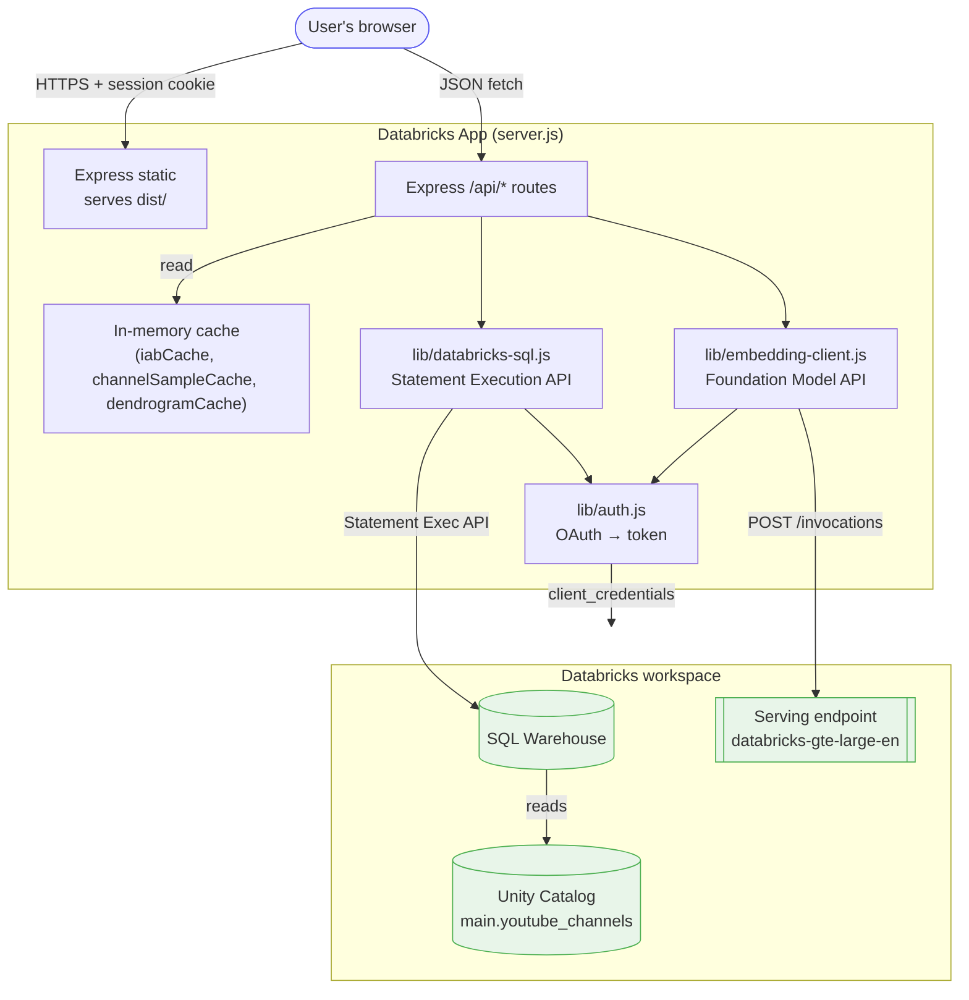
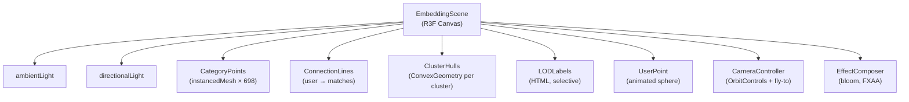
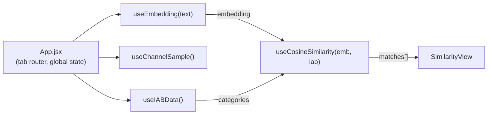

# Technical Guide: Embeddings Explorer

A detailed technical reference for the Embeddings Explorer Databricks App — architecture, API surface, auth flow, caching, 3D rendering patterns, frontend state, performance characteristics, and customization. For setup and deployment see [README.md](README.md). For a compact structural overview see [ARCHITECTURE.md](ARCHITECTURE.md).

> ⚠️ **Demo implementation.** Reference asset intended for adaptation. No SLA/warranty.

---

## Table of Contents

1. [Solution Overview](#1-solution-overview)
2. [Architecture](#2-architecture)
3. [Auth & Databricks Apps Runtime](#3-auth--databricks-apps-runtime)
4. [API Reference](#4-api-reference)
5. [Caching Strategy](#5-caching-strategy)
6. [3D Rendering Pipeline](#6-3d-rendering-pipeline)
7. [Frontend Tabs](#7-frontend-tabs)
8. [Frontend State & Hooks](#8-frontend-state--hooks)
9. [Local Dev vs Production](#9-local-dev-vs-production)
10. [Performance & Optimization](#10-performance--optimization)
11. [Customization Guide](#11-customization-guide)

---

## 1. Solution Overview

### What the app does

An interactive explorer over the output of the [YouTube Channel Classification pipeline](../youtube-channel-classification/). The pipeline produces UC tables; the app visualizes and debugs them in real time:

| Tab | Purpose | Primary data source |
|---|---|---|
| **Embedding Space** | 3D scatter of 698 IAB categories; cluster exploration | `iab_viz_precomputed` |
| **Load 0: Classify** | Type text → live embed → cosine similarity → ranked IAB labels | `iab_viz_precomputed` + FMAPI |
| **Load 1: KNN Refine** | Blend Load 0 with K nearest previously-classified channels | `channels_embeddings` + `channels_output` |
| **Taxonomy Analysis** | Dendrogram, confusion matrix, cluster purity | `iab_viz_precomputed` + `viz_dendrogram_linkage` |
| **Channel Galaxy** | 5,000 channels in 3D with category filtering | `channels_viz_sample` |

### Why an app and not a notebook

- **Explainability for non-technical stakeholders** — sales/product can inspect classifications without running SQL
- **Tuning workflow** — change a threshold slider, see labels shift in real time
- **Live classification demo** — type any text, see where it lands in IAB space
- **3D visualization** — depth cues make hierarchical taxonomies legible in a way tables can't

### Design principles

1. **Pre-compute heavy work** — t-SNE/UMAP/clustering done offline in the DAB; the app just reads coords
2. **Cache aggressively** — 698 + 5000 rows stay in server memory; never re-queried after startup
3. **Client-side math** — cosine similarity against 698 categories happens in JavaScript on the client's browser (fast, 1024-dim dot product × 698 is < 5ms)
4. **One embedding API call per user query** — live classification = 1 FMAPI call + 1 broadcast KNN query

---

## 2. Architecture

### High-level request flow



### Server layout

```
server.js                  # Express app — ~330 lines, single-file
lib/
├── auth.js                # OAuth client credentials flow + token cache
├── databricks-sql.js      # Wraps Statement Execution API
└── embedding-client.js    # POSTs to FMAPI serving endpoint

src/                       # React frontend (Vite)
├── App.jsx                # 5-tab router + global state
├── tabs/                  # Each tab is a self-contained React component
│   ├── ExplorerView.jsx   # Tab 1: Embedding Space
│   ├── SimilarityView.jsx # Tab 2: Load 0
│   ├── KNNView.jsx        # Tab 3: Load 1
│   ├── ClusteringView.jsx # Tab 4: Taxonomy Analysis
│   └── ChannelGalaxyView.jsx # Tab 5: Channel Galaxy
├── components/            # Reusable 3D + chart components
├── hooks/                 # Data-fetching and caching hooks
└── lib/                   # Client-side cosine / KNN / colors
```

### Why Express, not FastAPI or Next.js

- **Express + Vite SPA is the minimal full-stack shape** — single `node server.js` process serves the SPA build + `/api/*`
- **Lowest cold-start** on Databricks Apps (no Next.js framework overhead)
- **Easy to swap** — if you prefer FastAPI, the server is ~330 lines; rewriting it is a half-day's work

---

## 3. Auth & Databricks Apps Runtime

### Production: OAuth client credentials

When the app runs inside Databricks Apps, the platform **auto-injects three environment variables**:

| Variable | Source | Purpose |
|---|---|---|
| `DATABRICKS_CLIENT_ID` | App's service principal | OAuth client ID |
| `DATABRICKS_CLIENT_SECRET` | App's service principal | OAuth client secret |
| `DATABRICKS_HOST` | Workspace URL | `https://<workspace>.cloud.databricks.com` |

The server exchanges these for a short-lived access token via:

```
POST https://<host>/oidc/v1/token
Content-Type: application/x-www-form-urlencoded

grant_type=client_credentials
&client_id=<CLIENT_ID>
&client_secret=<CLIENT_SECRET>
&scope=all-apis
```

Response: `{"access_token": "...", "expires_in": 3600, ...}`

The token is **cached in-process** and refreshed 60 seconds before expiry. See [`lib/auth.js:19-58`](lib/auth.js).

### Local dev: static PAT

For `npm run dev`, set `DATABRICKS_TOKEN` in `.env` (from `databricks auth token -p <profile>`). The auth module checks for this first and skips the OAuth flow entirely.

### Token flow sequence

```mermaid
sequenceDiagram
    participant Browser
    participant Server as Express server
    participant Auth as lib/auth.js
    participant Dbx as Databricks OAuth

    Browser->>Server: GET /api/iab-data
    Server->>Auth: getToken()
    alt cached & valid
        Auth-->>Server: cached token
    else expired or first call
        Auth->>Dbx: POST /oidc/v1/token<br/>(client_credentials)
        Dbx-->>Auth: access_token, expires_in
        Auth->>Auth: cache token, set expiry-60s
        Auth-->>Server: new token
    end
    Server->>Dbx: Authorization: Bearer <token><br/>(SQL or FMAPI request)
    Dbx-->>Server: response
    Server-->>Browser: JSON
```



### Why client_credentials, not x-forwarded-access-token

Databricks Apps actually support **two** auth modes:

| Mode | Acts as | Use when |
|---|---|---|
| Client credentials (this app) | App's **service principal** | Same access for all users; centralized grants |
| `x-forwarded-access-token` | The **end user** | Per-user row-level access, data masking, user audit trails |

This app uses service principal auth because:
- Simpler permissions model — one SP to grant, one to audit
- All users see the same data (this is an explorer, not a private data tool)
- No per-user token refresh needed on the frontend

For a production deployment with per-user RLS, switch to forwarded-user-token mode. See `lib/auth.js` for the extension point.

---

## 4. API Reference

All routes are under `/api/*`. All return JSON. All errors come back as `{"error": "<message>"}` with 4xx/5xx status. All read access uses the SQL Warehouse; embedding uses FMAPI.

### GET `/api/health`

Sanity check. Returns `{status, catalog, schema}`.

```json
{"status":"healthy","catalog":"main","schema":"youtube_channels"}
```

### GET `/api/iab-data`

Returns all 698 IAB categories with embeddings + 3D coords + cluster labels. **Cached** in memory after first call.

```json
{
  "count": 698,
  "categories": [
    {
      "id": "150",
      "name": "Attractions",
      "tierPath": "Attractions",
      "tierLevel": 1,
      "tier1Parent": "Attractions",
      "description": "YouTube channels in 'Attractions' focus on...",
      "embedding": [0.012, -0.034, ..., 0.017],  // 1024 floats
      "tsne": [2.4, -1.8, 0.6],
      "umap": [0.8, 1.2, -0.3],
      "clusterKmeans": 4,
      "clusterHdbscan": 12
    }
  ]
}
```

**SQL:** `SELECT * FROM {catalog}.{schema}.iab_viz_precomputed`

### GET `/api/channels/sample`

Returns 5,000 pre-classified channels with coords. **Cached**. No embeddings (would be 5000 × 1024 = 20 MB).

```json
{
  "count": 5000,
  "channels": [
    {"id": "UC...", "title": "...", "primaryCategory": "...",
     "confidence": 0.72, "tsne": [...], "umap": [...]}
  ]
}
```

**SQL:** `SELECT * FROM {catalog}.{schema}.channels_viz_sample`

> ⚠️ **Route ordering matters.** This route MUST be defined **before** `/api/channels/:id` in Express, or `sample` is captured as the `:id` parameter. See [`server.js:123-125`](server.js).

### GET `/api/channels/search?q=<text>&limit=<n>`

Autocomplete channel search. Case-insensitive `LIKE` match on channel title. Input is regex-sanitized.

### GET `/api/channels/:id`

Single channel detail including embedding. Returns 404 if not found.

```json
{
  "id": "UCBJycsmduvYEL83R_U4JriQ",
  "title": "Marques Brownlee",
  "url": "...",
  "primaryCategory": "Technology & Computing",
  "primaryTierPath": "Technology & Computing > Consumer Electronics",
  "confidence": 0.78,
  "numCategories": 5,
  "textInput": "marques brownlee tech reviews...",
  "embedding": [0.012, ..., 0.017]
}
```

### POST `/api/embed`

Live embedding via FMAPI. Body: `{text: "..."}`. Text is trimmed to 2000 chars.

```json
// request
{"text": "basketball highlights NBA game analysis"}

// response
{"embedding": [0.012, ..., 0.017], "dimension": 1024, "latencyMs": 187}
```

**Latency:** ~100-400ms depending on warmth of the serving endpoint.

### POST `/api/knn/channels`

Server-side KNN against the full `channels_embeddings` table using SQL cosine similarity. Body: `{embedding: [...], k: 10}` (default K=10, max K=50).

The SQL uses `AGGREGATE` + `TRANSFORM` + `SEQUENCE` to compute cosine similarity in-engine — no data flows back to the Node server for scoring:

```sql
-- Conceptual (simplified from server.js:234-275)
WITH query AS (SELECT ARRAY(0.012, ..., 0.017) AS qemb),
scored AS (
  SELECT c.*,
    AGGREGATE(
      TRANSFORM(SEQUENCE(0, SIZE(q.qemb) - 1),
                i -> q.qemb[i] * c.embedding[i]),
      0D, (acc, x) -> acc + x
    ) / (NORM(q.qemb) * NORM(c.embedding)) AS similarity
  FROM channels_embeddings c CROSS JOIN query q
)
SELECT * FROM scored ORDER BY similarity DESC LIMIT 10
```

Why in SQL? Pulling 1.5M × 1024 embeddings into Node for scoring would cost ~6 GB of transfer per query. Scoring in-warehouse keeps the data where it lives.

### GET `/api/dendrogram`

Returns the pre-computed Ward linkage matrix (serialized as JSON). **Cached**. Frontend reconstructs the dendrogram tree with D3.

---

## 5. Caching Strategy

The server maintains three in-memory caches:

| Cache | Source query | Size | Invalidation |
|---|---|---|---|
| `iabCache` | 698 IAB categories | ~5 MB | Process restart (never during run) |
| `channelSampleCache` | 5,000 channels | ~3 MB | Process restart |
| `dendrogramCache` | 1-row linkage JSON | ~200 KB | Process restart |

### Warm-on-startup pattern

On boot, `warmCaches()` fires both SQL queries in parallel. This avoids the 50-second cold path on the first user request (warehouse wake-up + first query). See [`server.js:~330`](server.js).

```js
// Pseudocode
async function warmCaches() {
  await Promise.all([
    fetch('/api/iab-data'),        // internal call
    fetch('/api/channels/sample'),
  ]);
  console.log('Caches warm');
}
warmCaches();  // fire-and-forget, doesn't block startup
```

> ⚠️ **Gotcha:** if `warmCaches()` fails (e.g. missing warehouse binding at startup), the caches stay empty and the next request retries the query — but the retry hits the same cold warehouse and incurs the full 50s again. See README "Troubleshooting" for how to diagnose.

### Why no Redis / KV cache

- All cacheable data is < 10 MB — fits comfortably in Node heap
- No multi-instance deployment (Apps runs one replica per deploy)
- Zero-config: no external dependency

If you scale to multi-instance, move caches to Redis or the SQL warehouse result cache.

---

## 6. 3D Rendering Pipeline

The 3D visualization is the most technically interesting part of the app. Two scenes:

- **`EmbeddingScene`** (Tab 1 + 2 + 3) — 698 IAB categories as spheres in 3D
- **`GalaxyScene`** (Tab 5) — 5,000 channels as smaller points, with category filtering

Both use **React-Three-Fiber** (React bindings over Three.js) + **drei** (helpers) + **postprocessing** (bloom, FXAA).

### InstancedMesh — why and how

Naively rendering 5,000 spheres as individual meshes would cost ~5,000 draw calls → sub-10 FPS on mid-range hardware. **InstancedMesh** batches all spheres into a single draw call:

```js
// Simplified from src/components/CategoryPoints.jsx
const meshRef = useRef();
const tmpObject = useMemo(() => new THREE.Object3D(), []);
const tmpColor = useMemo(() => new THREE.Color(), []);

useFrame(() => {
  for (let i = 0; i < categories.length; i++) {
    tmpObject.position.set(...positions[i]);
    tmpObject.scale.setScalar(sizes[i]);
    tmpObject.updateMatrix();
    meshRef.current.setMatrixAt(i, tmpObject.matrix);

    tmpColor.set(colors[i]);
    meshRef.current.setColorAt(i, tmpColor);
  }
  meshRef.current.instanceMatrix.needsUpdate = true;
  meshRef.current.instanceColor.needsUpdate = true;
});

return (
  <instancedMesh ref={meshRef} args={[null, null, categories.length]}>
    <sphereGeometry args={[1, 12, 8]} />
    <meshStandardMaterial />
  </instancedMesh>
);
```

**Performance pattern — reusable temp objects:** `tmpObject` and `tmpColor` live in `useMemo`, so a single `THREE.Object3D` is reused for every sphere every frame. Allocating inside `useFrame` would generate ~5000 new objects per frame = GC storm.

**Dirty-flag pattern:** `initializedRef` and `prevHoveredRef` skip the `useFrame` body when nothing has changed:

```js
useFrame(() => {
  if (initializedRef.current && prevHoveredRef.current === hovered) return;
  // ... expensive update
  initializedRef.current = true;
  prevHoveredRef.current = hovered;
});
```

Without this, 5,000 matrix updates happen 60× per second for static scenes — wasted work.

### Projection toggle (t-SNE vs UMAP)

Two different dimensionality reduction methods are pre-computed by the DAB:

| Method | Strength | Weakness |
|---|---|---|
| **t-SNE** | Clusters pop cleanly; local structure excellent | Distances between clusters are meaningless |
| **UMAP** | Preserves both local and global structure | Slightly less cluster separation |

The `SceneControls` overlay toggles which one is used; `coordKey` prop threads through the component tree. **Gotcha:** when `projection` changes, the positions array regenerates and `initializedRef.current = false` is set — forces a re-render of all instance matrices.

### LOD labels

Rendering 698 HTML labels in 3D kills frame rate. `LODLabels` (drei's `Html` with custom visibility) only renders labels for:
- The currently hovered category
- Any cluster being filtered
- The user's query position

Everything else gets a text-free sphere.

### Cluster hulls (ConvexGeometry)

When the user filters to one cluster, `ClusterHulls` renders a semi-transparent `ConvexGeometry` around the cluster members. **Gotcha:** ConvexGeometry needs ≥ 4 points (a tetrahedron). Guard with `if (points.length < 4) return null;`.

### Camera fly-to

`CameraController` smoothly animates the camera to a target position when the user clicks a category or pastes a channel. Uses easing over ~60 frames. Prevents jarring teleports.

### Scene graph summary



---

## 7. Frontend Tabs

### Tab 1: Embedding Space (`ExplorerView`)

Pure exploration of the 698 IAB categories. No user input — just the 3D scatter.

**Controls:**
- Projection toggle (t-SNE / UMAP)
- Cluster highlight dropdown
- Tier 1 filter
- Color mode: by Tier 1 parent, by KMeans cluster, by HDBSCAN cluster

### Tab 2: Load 0 — Classify (`SimilarityView`)

The live classification demo. User types text (or clicks a demo channel) → embed → score.

**Flow:**
```mermaid
sequenceDiagram
    User->>Frontend: type "tech reviews"
    Frontend->>/api/embed: POST {text}
    /api/embed->>FMAPI: POST /invocations
    FMAPI-->>/api/embed: 1024-dim vector
    /api/embed-->>Frontend: {embedding, latencyMs}
    Frontend->>Frontend: cosine sim × 698 IAB<br/>(client-side, 3ms)
    Frontend->>3D: render user point + connection lines
    Frontend->>Charts: bar chart, histogram, radar
```

**Client-side cosine** (see `src/lib/cosine.js`):
```js
function cosine(a, b) {
  let dot = 0, normA = 0, normB = 0;
  for (let i = 0; i < a.length; i++) {
    dot += a[i] * b[i];
    normA += a[i] * a[i];
    normB += b[i] * b[i];
  }
  return dot / (Math.sqrt(normA) * Math.sqrt(normB));
}
```

At 1024 dims × 698 categories this runs in ~3ms in V8. See [docs/cosine-similarity.md](../youtube-channel-classification/docs/cosine-similarity.md) in the companion DAB for the math deep-dive.

**Controls:**
- Threshold slider (0.1 – 0.7)
- Show confidence gap (top-1 minus top-2)
- Radar chart of top 8

### Tab 3: Load 1 — KNN Refine (`KNNView`)

After Tab 2 produces a Load 0 classification, Tab 3 finds the K nearest **channels** (not categories) and shows how their labels vote.

**Flow:**
1. Take the embedding from Tab 2
2. POST `/api/knn/channels` → SQL cosine sim against `channels_embeddings`
3. Render force graph (D3) of the user → K neighbors
4. Show neighbor labels and the blended L1 score: `0.75 × L0 + 0.25 × KNN_support`

### Tab 4: Taxonomy Analysis (`ClusteringView`)

Not interactive classification — structural analysis of the taxonomy itself.

- **Dendrogram** (Ward linkage, D3) — hierarchical clustering of the 698 categories
- **Confusion matrix** — Tier 1 labels × KMeans cluster assignments
- **Cluster purity** — stacked bar chart showing cluster composition

Useful for the customer to understand whether KMeans cluster boundaries match the IAB hierarchy.

### Tab 5: Channel Galaxy (`ChannelGalaxyView`)

The 5,000 pre-classified channels in 3D space, color-coded by primary category. Select a category → see the channels in that category, with lines drawn from the category anchor.

Different scene (`GalaxyScene`) than Tabs 1-3 because the point count (5K vs 698) has different performance characteristics. Both scenes share the camera controller, color palette, and projection logic.

---

## 8. Frontend State & Hooks

### Hook inventory

| Hook | Source | Purpose |
|---|---|---|
| `useIABData` | `/api/iab-data` | Fetches and caches IAB categories (React state) |
| `useEmbedding` | `/api/embed` | Calls embed for given text, returns `{embedding, latency, error, loading}` |
| `useCosineSimilarity` | client-side | Pure function hook: given embedding + IAB list → ranked matches |
| `useChannelSample` | `/api/channels/sample` | Fetches 5K channels with retry logic |
| `useChannelSearch` | `/api/channels/search` | Debounced (300ms) autocomplete |

### State flow



State is **lifted to `App.jsx`** so that a user typing text in Tab 2 doesn't lose it when they switch to Tab 3 — the embedding is still in scope.

No Redux / Zustand / Jotai — the app is small enough that `useState` + prop drilling is simpler than a global store.

---

## 9. Local Dev vs Production

| Aspect | Local Dev (`npm run dev`) | Production (Databricks App) |
|---|---|---|
| Auth | `DATABRICKS_TOKEN` PAT | OAuth client credentials (auto-injected) |
| Serving | Vite dev server (5173) proxies `/api/*` to Express (8000) | Single Express process, serves `dist/` + API |
| HMR | Yes (Vite) | No (redeploy to update) |
| Warehouse binding | Set `DATABRICKS_WAREHOUSE_ID` in `.env` | Resource binding: `valueFrom: sql-warehouse` in `app.yaml` |
| Logs | Terminal | `databricks apps logs <app> -p <profile>` |
| Cold start | None (warm at all times) | ~50s on first request after deploy (caches warming) |

See `.env.example` for the local dev variable list.

---

## 10. Performance & Optimization

### Latency budget (production, warm)

| Operation | Typical latency | Dominant factor |
|---|---|---|
| `/api/health` | < 10 ms | Nothing — returns env vars |
| `/api/iab-data` (cached) | < 20 ms | Node JSON serialization |
| `/api/iab-data` (cold, first call) | 5-15 s | SQL warehouse startup + query |
| `/api/embed` | 100-400 ms | FMAPI endpoint warmth |
| `/api/knn/channels` | 2-5 s | SQL cosine over 1.5M rows (in-engine compute) |
| `/api/channels/sample` (cached) | < 50 ms | Node JSON serialization |
| 3D scene render (steady state) | 60 FPS | GPU (instancedMesh fast-path) |
| Client-side cosine × 698 | ~3 ms | V8 JIT |

### Known bottlenecks

1. **Cold start after deploy (~50s)** — warehouse wake-up + first query. Mitigation: `warmCaches()` fires on process startup.
2. **KNN query (~2-5s)** — scanning 1.5M embeddings in SQL. Mitigation options: (a) pre-compute KNN for common query embeddings, (b) switch to Databricks Vector Search for sub-second lookups.
3. **Initial `/api/iab-data` payload (~5 MB)** — 698 × 1024 floats is large. Mitigation: gzip is on (via `compression`); consider serving embeddings separately and loading on-demand if bandwidth is an issue.
4. **Dev `node_modules/` is ~244 MB** — gets stripped to ~2 MB for deploy via `scripts/deploy.sh`. Never upload the dev tree.

### Scale considerations

The current caches (698 + 5K rows) scale easily. The pieces that won't scale linearly:
- **IAB payload** — if taxonomy grows to 5,000+ categories, initial load becomes slow. Paginate or lazy-load embeddings.
- **Channel sample (5K)** — if you want to show 50K+, switch from in-memory cache to on-demand tile fetching.
- **Server-side KNN** — at 10M+ channels, exact cosine becomes 20+ seconds. Use Databricks Vector Search.

---

## 11. Customization Guide

### Swap the taxonomy

The app is taxonomy-agnostic. To replace IAB with a different taxonomy (products, support categories, game genres):

1. **Rebuild the tables** — run the DAB pipeline with your taxonomy's TSV; the output table names stay the same
2. **Update Tier 1 colors** — edit `src/lib/colors.js` (26 colors mapped to top-level groupings)
3. **Update tab labels** — in `src/App.jsx`, rename "Load 0: Classify IAB" etc. to match your domain
4. **Keep everything else** — the UI, 3D, cosine math, caching are all unchanged

### Change the embedding model

Re-bind the `serving-endpoint` resource in **Apps → Resources** to your chosen endpoint and redeploy — no code change needed. The endpoint name is injected at startup as `EMBEDDING_ENDPOINT_NAME` via `valueFrom: 'serving-endpoint'` in `app.yaml`, and `lib/embedding-client.js` reads it from the env (defaulting to `databricks-gte-large-en` when unset).

Ensure the new endpoint:
- Accepts `{input: [text]}` request body
- Returns `{data: [{embedding: [...]}]}` response
- Has the same dimension as the embeddings pre-computed in the DAB (or rebuild the DAB too)

### Tune thresholds

| Knob | File | Effect |
|---|---|---|
| Similarity threshold (Load 0) | `src/lib/cosine.js` | Lower = more labels, more noise |
| Confidence gap (multi vs single label) | `src/lib/cosine.js` | Default 0.08 — tighter → more often multi-label |
| KNN K | `src/lib/knn.js` | Default varies per tab |
| L0/KNN blend weights (Load 1) | `src/lib/knn.js` | Default 0.75/0.25 |

### Add a new tab

1. Create `src/tabs/YourView.jsx`
2. Add to the tab list in `src/App.jsx`
3. If it needs a new backend route, add it in `server.js` **before** any parameterized routes
4. If it needs new UC tables, add a DAB job to produce them

### Swap SQL Warehouse → Vector Search

For sub-second KNN at 10M+ scale:
1. Create a Vector Search index over `channels_embeddings`
2. Add a new route `/api/knn/channels-fast` that hits the index
3. Frontend toggle between the two

Keep the SQL path as a fallback — Vector Search has different availability/cost characteristics.
