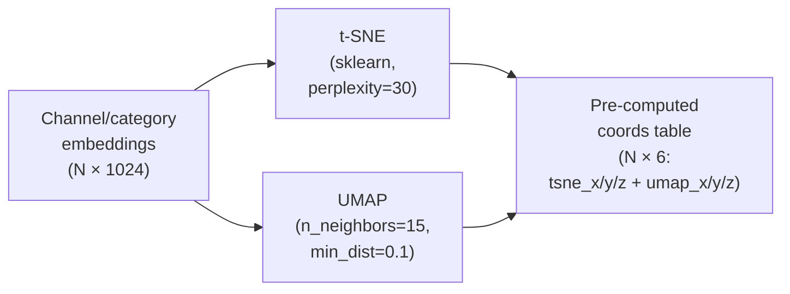

# 3D Visualization

The 3D embedding space is the app's most visible feature and its most technically interesting code. This page goes deep on how 698 IAB categories (and 5,000 channels, in the Galaxy tab) are rendered at 60 FPS in a web browser, and how 1024-dimensional embeddings are projected down to 3D coordinates the eye can read.

---

## Why 3D at all?

Embeddings live in 1024-dimensional space. You can't visualize that directly. Two options:

| Option | Pros | Cons |
|---|---|---|
| **Tables of similarity scores** | Exact, searchable | Lose all spatial intuition; can't see clusters |
| **2D scatter** (t-SNE or UMAP) | Simple, fits on a page | Lose one dimension — distant clusters crowd each other |
| **3D scatter** (this app) | Depth cues reveal cluster topology | GPU required; UX learning curve (orbit controls) |

3D is worth it when the taxonomy has hierarchical structure (which IAB does — 30 Tier-1 groups, each with 10-50 subcategories). Rotation reveals "Sports" as a dense cluster near "Gaming", "Food" far from both, and "Music" bridging to "Entertainment" — exactly the relationships the IAB committee curates.

---

## From 1024 dims to 3D: the projection step

The raw embeddings aren't the coordinates you see. The DAB pipeline pre-computes two different projections:



Both are computed once during `02_precompute_viz_data.py` and stored in `iab_viz_precomputed` / `channels_viz_sample`. The app reads coords, never recomputes.

### t-SNE

- **Strength:** maximally separates clusters. If your data has 10 distinct topics, t-SNE will make them visibly distinct in 3D.
- **Weakness:** **distances between clusters are meaningless**. "Sports" may look 10× farther from "Cooking" than from "Music" on one run, and reverse on another. Only cluster membership is reliable.
- **When to use:** eyeballing "are these topics actually separable?"

### UMAP

- **Strength:** preserves local **and** global structure. Distances are semi-meaningful — "Music" will consistently sit between "Entertainment" and "Audio" if those relationships exist in embedding space.
- **Weakness:** clusters are less crisp — more visual blending.
- **When to use:** navigating the hierarchy ("is X closer to Y or Z?")

### The toggle

`SceneControls` exposes a t-SNE ↔ UMAP toggle. Internally, `projection` is a React state prop threaded through the component tree. `coordKey` derives from it:

```js
const coordKey = projection === 'tsne' ? 'tsne' : 'umap';
positions[i] = categories[i][coordKey]; // [x, y, z]
```

When the user toggles, all 698 positions regenerate. The instancedMesh pattern (next section) makes this cheap — no object destruction, just a matrix update.

---

## Rendering 698 spheres in one draw call — instancedMesh

Naive approach:
```jsx
// ~5000 draw calls for 5K channels. Sub-10 FPS. Don't do this.
{channels.map(c => (
  <mesh position={c.position} key={c.id}>
    <sphereGeometry />
    <meshStandardMaterial color={c.color} />
  </mesh>
))}
```

Instanced approach:
```jsx
// 1 draw call, GPU handles per-instance positions/colors. 60 FPS at 50K points.
<instancedMesh ref={meshRef} args={[null, null, channels.length]}>
  <sphereGeometry args={[1, 12, 8]} />
  <meshStandardMaterial />
</instancedMesh>
```

Each instance's transform and color are written into GPU-side `Matrix4` and `Color` arrays. The vertex shader reads per-instance data and draws all spheres in a single GPU submit.

### The full pattern

```js
// src/components/CategoryPoints.jsx (conceptual)

const CategoryPoints = ({ categories, coordKey, hoveredId }) => {
  const meshRef = useRef();
  const initializedRef = useRef(false);
  const prevHoveredRef = useRef(null);

  // Reusable temp objects — NEVER allocate in useFrame
  const tmpObject = useMemo(() => new THREE.Object3D(), []);
  const tmpColor = useMemo(() => new THREE.Color(), []);

  // Precompute positions and base colors
  const positions = useMemo(
    () => categories.map(c => c[coordKey]),
    [categories, coordKey]
  );
  const baseColors = useMemo(
    () => categories.map(c => TIER1_COLORS[c.tier1Parent]),
    [categories]
  );

  // Force re-init when data shape changes
  useMemo(() => {
    initializedRef.current = false;
  }, [categories, coordKey]);

  useFrame(() => {
    // Dirty-flag — skip if nothing changed
    if (initializedRef.current && prevHoveredRef.current === hoveredId) return;

    for (let i = 0; i < categories.length; i++) {
      tmpObject.position.set(...positions[i]);
      tmpObject.scale.setScalar(hoveredId === categories[i].id ? 1.8 : 1.0);
      tmpObject.updateMatrix();
      meshRef.current.setMatrixAt(i, tmpObject.matrix);

      tmpColor.set(baseColors[i]);
      if (hoveredId && categories[i].id !== hoveredId) {
        tmpColor.multiplyScalar(0.3);  // dim non-hovered
      }
      meshRef.current.setColorAt(i, tmpColor);
    }

    meshRef.current.instanceMatrix.needsUpdate = true;
    meshRef.current.instanceColor.needsUpdate = true;

    initializedRef.current = true;
    prevHoveredRef.current = hoveredId;
  });

  return (
    <instancedMesh
      ref={meshRef}
      key={categories.length}  // remount when data shape changes
      args={[null, null, categories.length]}
      onPointerMove={...}
    >
      <sphereGeometry args={[0.15, 12, 8]} />
      <meshStandardMaterial />
    </instancedMesh>
  );
};
```

### Performance rules

| Rule | Why |
|---|---|
| Temp objects in `useMemo`, **never** inside `useFrame` | Allocating 5000 `Color` objects 60× per second = GC storm |
| Dirty-flag refs (`initializedRef`) | Skip redundant updates when state is stable |
| `key={categories.length}` on instancedMesh | React creates a new buffer when array size changes — required |
| Reset `initializedRef.current = false` inside relevant `useMemo`s | Force a re-render when positions array changes |
| `setMatrixAt` / `setColorAt` + `instanceMatrix.needsUpdate = true` | How Three.js knows to upload to GPU |

### Why not `<points>` / `<Points>` from drei?

Both work for simple point clouds. We use `instancedMesh` because:
- Spheres (with lighting/shading) look more 3D than points
- Per-instance scale lets hovered points pop
- Per-instance color lets us dim non-hovered

For 100K+ points you'd switch to `<points>` — at that scale, full sphere meshes become GPU-bound even with instancing.

---

## LOD labels

HTML-in-3D (`<Html>` from drei) is expensive: each label is a DOM node, and 698 of them destroy frame rate. `LODLabels` only renders labels that are actually useful:

```js
const labelsToShow = useMemo(() => {
  const ids = new Set();
  if (hoveredId) ids.add(hoveredId);
  if (filteredClusterId != null) {
    categories
      .filter(c => c.clusterKmeans === filteredClusterId)
      .forEach(c => ids.add(c.id));
  }
  if (userMatches) userMatches.slice(0, 5).forEach(m => ids.add(m.id));
  return categories.filter(c => ids.has(c.id));
}, [categories, hoveredId, filteredClusterId, userMatches]);

return labelsToShow.map(c => (
  <Html position={c[coordKey]} key={c.id}>
    <div className="label">{c.name}</div>
  </Html>
));
```

Typical visible count: 0-20 labels at any time. Stays buttery smooth.

---

## Cluster hulls (ConvexGeometry)

When the user selects a cluster, we render a semi-transparent hull around its members:

```js
import { ConvexGeometry } from 'three/addons/geometries/ConvexGeometry';

function ClusterHull({ points, color }) {
  if (points.length < 4) return null;  // ConvexGeometry needs tetrahedron minimum

  const geometry = useMemo(
    () => new ConvexGeometry(points.map(p => new THREE.Vector3(...p))),
    [points]
  );

  return (
    <mesh geometry={geometry}>
      <meshBasicMaterial color={color} transparent opacity={0.15} depthWrite={false} />
    </mesh>
  );
}
```

`depthWrite={false}` prevents the hull from occluding points inside it. `transparent + opacity 0.15` is a sweet spot for "I can see it but it's not in the way."

---

## Camera fly-to

When the user clicks a category (or pastes a channel URL), the camera smoothly animates to frame that point instead of teleporting.

```js
// Pseudocode — src/components/CameraController.jsx
useFrame(({ camera }, delta) => {
  if (!target) return;

  const lerpSpeed = 4 * delta;  // frame-rate independent
  camera.position.lerp(target.position, Math.min(1, lerpSpeed));
  camera.lookAt(target.lookAt);

  if (camera.position.distanceTo(target.position) < 0.01) {
    onAnimationComplete();  // clear target
  }
});
```

Frame-rate-independent lerp (`4 * delta`) means the animation completes in ~0.25s regardless of FPS.

---

## Post-processing (bloom)

`<EffectComposer><Bloom /></EffectComposer>` adds a subtle glow to bright spheres — makes the user's query point visually pop from the crowd. Configured for low intensity to avoid that "2010 game" look.

```js
<EffectComposer>
  <Bloom
    intensity={0.4}
    luminanceThreshold={0.8}  // only bright things bloom
    luminanceSmoothing={0.3}
  />
  <FXAA />
</EffectComposer>
```

**FXAA** smooths aliased edges without the perf cost of MSAA. Good enough for this kind of sparse scene.

---

## Two scenes, shared components

| Component | Used by Embedding Space (Tabs 1-3) | Used by Channel Galaxy (Tab 5) |
|---|---|---|
| `EmbeddingScene` | ✓ main canvas | — |
| `GalaxyScene` | — | ✓ main canvas |
| `CategoryPoints` | ✓ (698 IAB) | — |
| `ChannelGalaxy` | — | ✓ (5K channels) |
| `ConnectionLines` | ✓ | — |
| `CategoryChannelEdges` | — | ✓ |
| `ClusterHulls` | ✓ | — |
| `LODLabels` | ✓ | ✓ |
| `UserPoint` | ✓ | — |
| `CameraController` | ✓ | ✓ |
| `SceneControls` overlay | ✓ | ✓ |

Both scenes share the camera controller, projection toggle, and color palette — consistent feel across tabs.

---

## Performance budget

| Operation | Target | Measured |
|---|---|---|
| Initial mount (698 points) | < 500 ms | ~200 ms on M1 Pro |
| Projection toggle (t-SNE ↔ UMAP) | < 100 ms | ~30 ms |
| Hover state change | < 16 ms (1 frame) | ~5 ms |
| Sustained frame rate (steady, 698 points) | 60 FPS | 60 FPS |
| Sustained frame rate (Galaxy, 5K points) | 60 FPS | 60 FPS on M1; ~45 FPS on integrated GPU |

If your users are on integrated GPUs, reduce sphere geometry detail:
```js
<sphereGeometry args={[0.15, 8, 6]} />  // instead of [0.15, 12, 8]
```

Trade: slightly less smooth silhouette, ~2× draw throughput.

---

## Gotchas

1. **Safari WebGL2 support** — works since Safari 15 (2021). Older Safari falls back to a blank canvas. The app's README flags this.
2. **Mobile rendering** — works but controls are awkward. Not a supported surface.
3. **React StrictMode double-mount** — drei and R3F handle this, but custom instanced components may init twice. Watch for "why are my spheres flickering on load"; guard with the dirty flag.
4. **`key` prop on instancedMesh** — forgetting it means the old GPU buffer sticks around when `categories.length` changes, causing ghost points.

---

## Further reading

- [React-Three-Fiber docs](https://docs.pmnd.rs/react-three-fiber/)
- [drei helpers](https://github.com/pmndrs/drei)
- [Three.js instancedMesh reference](https://threejs.org/docs/#api/en/objects/InstancedMesh)
- [t-SNE vs UMAP comparison (Understanding UMAP)](https://pair-code.github.io/understanding-umap/)
