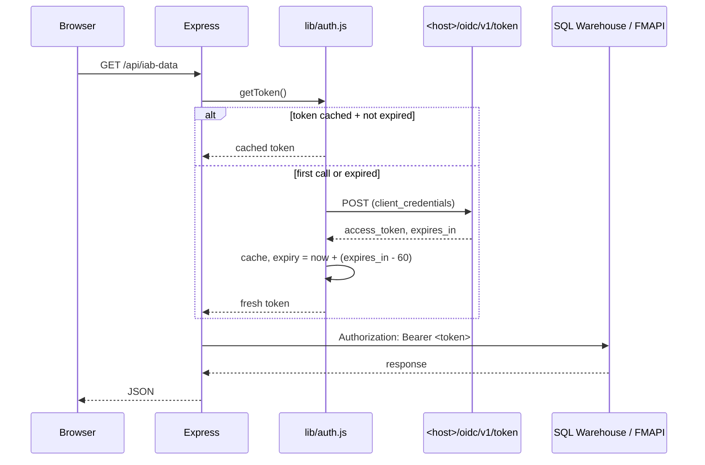

# Authentication

Two auth modes, one code path. Production runs on Databricks Apps OAuth; local dev falls back to a static PAT. The flow is implemented in [`lib/auth.js`](../lib/auth.js).

---

## The two modes at a glance

| Aspect | Production (Databricks Apps) | Local dev |
|---|---|---|
| Token source | OAuth client_credentials | Static PAT from `.env` |
| Env vars | `DATABRICKS_CLIENT_ID`, `DATABRICKS_CLIENT_SECRET`, `DATABRICKS_HOST` | `DATABRICKS_TOKEN`, `DATABRICKS_HOST` |
| Who sets them | Databricks Apps runtime (auto-injected) | You, via `.env` |
| Identity | App's **service principal** | Your user account |
| Token lifetime | ~1 hour (auto-refreshed) | Hours to months (whatever the PAT is set to) |
| Refresh logic | Client credentials flow re-run before expiry | None needed |

---

## Production flow: OAuth client credentials

When the app boots inside Databricks Apps, the platform injects three environment variables:

```
DATABRICKS_HOST=https://<workspace>.cloud.databricks.com
DATABRICKS_CLIENT_ID=<app's SP client id>
DATABRICKS_CLIENT_SECRET=<app's SP client secret>
```

On the first API call that needs auth, `lib/auth.js` exchanges these for a short-lived bearer token:

```http
POST https://<host>/oidc/v1/token
Content-Type: application/x-www-form-urlencoded

grant_type=client_credentials
&client_id=<CLIENT_ID>
&client_secret=<CLIENT_SECRET>
&scope=all-apis
```

Response:
```json
{
  "access_token": "...",
  "token_type": "Bearer",
  "expires_in": 3600
}
```

The token is cached in-process and **refreshed 60 seconds before expiry** to avoid mid-request expiration.

### Sequence



### Why client credentials, not forwarded-user-token

Databricks Apps support two auth modes. This app uses **service principal** (client_credentials). The alternative is **on-behalf-of-user**, where the app forwards the caller's token (`x-forwarded-access-token` header) to downstream services.

Pick based on your needs:

| Concern | Service principal (this app) | On-behalf-of-user |
|---|---|---|
| Permissions model | Grant once on the SP | Depends on each user's grants |
| Same data for all users | ✓ | ✗ — each user sees their own slice |
| Row-level security / masking | ✗ (SP sees everything) | ✓ |
| Audit trail per user | ✗ (all queries as SP) | ✓ |
| Setup complexity | Lower | Higher |

For a generic explorer over already-classified public data (this app), SP is simpler and sufficient. For a production data tool with PII, switch to per-user.

### Switching to on-behalf-of-user

1. In the Databricks Apps UI, set the app's auth mode to "on behalf of user"
2. In every request handler, read `req.headers['x-forwarded-access-token']`
3. Pass that token directly to SQL / FMAPI calls (skip `getToken()` entirely)
4. Enforce UC row-level security with the user's identity

`lib/auth.js` can coexist with a user-token path — keep it as a fallback for background/warm-up calls that don't have a user context.

---

## Local dev flow: static PAT

Local `npm run dev` doesn't have the OAuth injection. Instead, set `DATABRICKS_TOKEN` in `.env`:

```bash
# .env (gitignored)
DATABRICKS_HOST=https://<workspace>.cloud.databricks.com
DATABRICKS_TOKEN=dapi...
DATABRICKS_WAREHOUSE_ID=<warehouse-id>
CATALOG=main
SCHEMA=youtube_channels
```

Generate the PAT:
```bash
databricks auth token -p <your-profile> -o json | jq -r .access_token
# or via UI: User Settings → Developer → Access tokens
```

`lib/auth.js` checks for `DATABRICKS_TOKEN` first and returns it directly, skipping the OAuth dance:

```js
export async function getToken() {
  const staticToken = process.env.DATABRICKS_TOKEN;
  if (staticToken) return staticToken;
  // ... else do OAuth flow
}
```

The PAT acts as **you**, so permissions match your account. This is typically what you want for local UI iteration.

**Don't commit `.env`.** It's in `.gitignore`, but double-check before any push.

---

## Common auth failures

### Missing env vars

```
Error: Missing auth: set DATABRICKS_TOKEN (local) or ensure
       DATABRICKS_CLIENT_ID/SECRET are injected (Apps runtime)
```

**Production:** the app deployment didn't inject the creds. Confirm the app was created via `databricks apps create` (not manually). Redeploy.

**Local:** your `.env` is missing `DATABRICKS_TOKEN` or the file itself isn't loaded. Check that you're reading it (most Express apps need `dotenv` configured explicitly — this app uses Node's native `--env-file` flag or manual process.env).

### OAuth 401 / 403

```
Error: OAuth token error 401: {"error_code":"INVALID_CREDENTIALS",...}
```

App SP credentials are wrong or rotated. Not fixable from code — the runtime auto-manages them. If this happens in production, open a ticket.

### 403 on SQL / FMAPI after token succeeds

Token is valid but the SP doesn't have permission on the target resource:

- **SQL warehouse:** grant `Can use` in Compute → SQL Warehouses → Permissions
- **Unity Catalog:** grant `USE CATALOG`, `USE SCHEMA`, `SELECT`
- **Serving endpoint:** grant `Can query` in Serving → Permissions

See README "Service principal permissions" for commands.

### Token caching quirks

- The cache is **in-process** — no persistence across restarts. That's fine; refreshes are cheap.
- If you redeploy and the old cached token becomes invalid, requests fail until the cache entry expires. The 60-second buffer mitigates this.
- Multi-instance deployments would each cache their own token. Not currently an issue (Apps runs one instance), but a consideration if you scale out.

---

## Token forwarding to downstream services

The SQL and FMAPI clients both call `getToken()` per request:

```js
// lib/databricks-sql.js
const token = await getToken();
const res = await fetch(`${host}/api/2.0/sql/statements`, {
  method: 'POST',
  headers: {
    Authorization: `Bearer ${token}`,
    'Content-Type': 'application/json',
  },
  body: JSON.stringify({ warehouse_id: WAREHOUSE_ID, statement: sql }),
});
```

```js
// lib/embedding-client.js
const token = await getToken();
const res = await fetch(`${host}/serving-endpoints/${MODEL}/invocations`, {
  method: 'POST',
  headers: {
    Authorization: `Bearer ${token}`,
    'Content-Type': 'application/json',
  },
  body: JSON.stringify({ input: [text] }),
});
```

No other code paths make authenticated Databricks calls.

---

## Security checklist

When adapting this for production:

- [ ] Switch to on-behalf-of-user mode if users should see different data
- [ ] Grant the SP only the catalogs/schemas it needs — not `*` wildcards
- [ ] Set PAT expirations on local dev tokens (don't create no-expiry tokens)
- [ ] Ensure `.env` is gitignored (the shipped `.gitignore` handles this)
- [ ] For public-facing use, add rate limiting (e.g., `express-rate-limit`) to `/api/embed` and `/api/knn/channels` — they're the expensive endpoints
- [ ] Audit what data leaves the app — avoid putting PII into log messages
- [ ] Rotate PATs and app SP credentials per your org's policy
