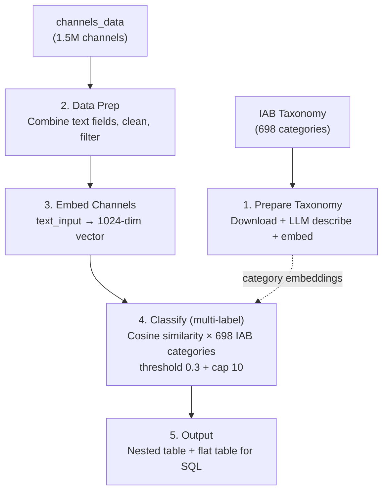
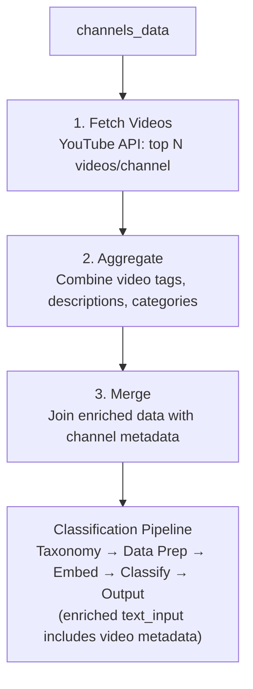
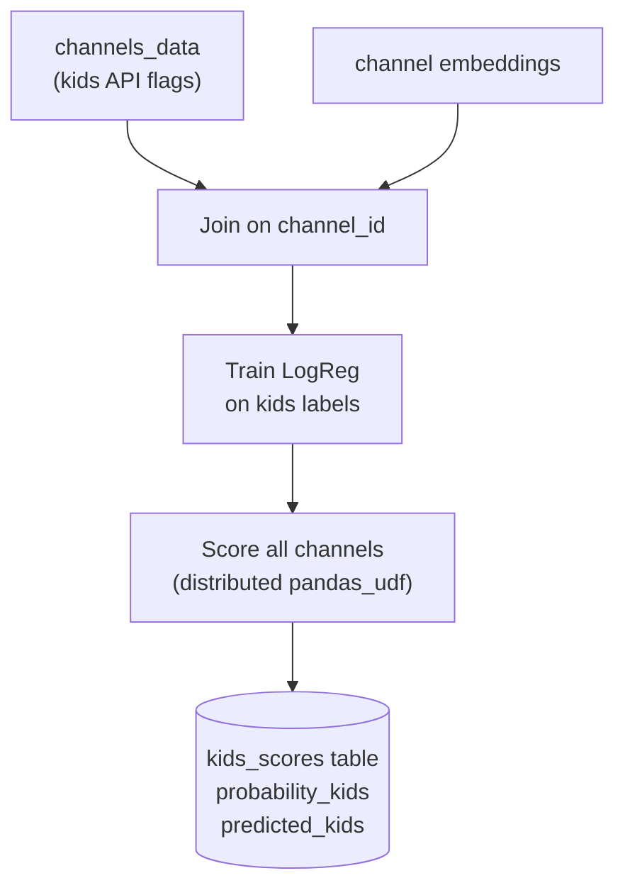

# YouTube Channel Classification Pipeline

Classify ~1.5 million YouTube channels into **IAB Content Taxonomy** categories using semantic embeddings and cosine similarity. Multi-label — each channel can belong to up to 10 categories and subcategories.

Built on Databricks with Spark, packaged as a **Databricks Asset Bundle (DAB)** for one-command deployment.

> ⚠️ **Demo implementation.** This is a reference/demo asset intended for adaptation, not a production-ready product. No SLA, no warranty, no official support. Use it to learn the pattern, then adapt for your own domain, data, and scale.

Companion Databricks App: [`../embeddings-explorer/`](../embeddings-explorer/) — an interactive 3D explorer over the tables this pipeline produces.

---

## Table of Contents

1. [Overview](#overview)
2. [Architecture](#architecture)
3. [How the Classification Works](#how-the-classification-works)
4. [Project Structure](#project-structure)
5. [Quick Start](#quick-start)
6. [Configuration](#configuration)
7. [Output Schema](#output-schema)
8. [Enrichment & YouTube API](#enrichment--youtube-api)
9. [Kids Classifier](#kids-classifier)
10. [Cluster Sizing](#cluster-sizing)
11. [Extending the Pipeline](#extending-the-pipeline)

---

## Overview

### Problem

Given a dataset of ~1.5M YouTube channel metadata (titles, descriptions, keywords, topic categories), classify each channel into standardized content categories for ad targeting and brand safety.

### Approach

1. **IAB Content Taxonomy v3.0** — Industry-standard taxonomy with ~700 categories across 4 tiers, used by ad exchanges and DSPs worldwide
2. **Semantic embeddings** — Convert channel text and category descriptions into 1024-dimensional vectors
3. **Cosine similarity** — Compare each channel's vector against all category vectors to find the best matches
4. **Multi-label** — Channels can belong to multiple categories (threshold-based, capped at 10)

### Key Design Decisions

| Decision | Choice | Why |
|----------|--------|-----|
| Taxonomy | IAB Content Taxonomy v3.0 | Industry standard, directly actionable for ad targeting |
| Classification | Cosine similarity on embeddings | Scales to millions, multi-label, zero per-channel inference cost |
| Embedding model | `databricks-gte-large-en` (1024-dim) | No GPU needed, Foundation Model API |
| Kids detection | Independent classifier | Separate concern, runs on its own schedule |
| Enrichment | Optional video metadata | Improves quality but requires YouTube API quota |

---

## Architecture

### Pipeline A: Classify Channels (No API Needed)



**DAB Job:** `classify-channels` (6 tasks, sequential)

### Pipeline B: Enrich Then Classify (Requires YouTube API)



**DAB Job:** `enrich-and-classify` (9 tasks, sequential)

### Pipeline C: Kids Classifier (Independent)



**DAB Job:** `kids-classifier` (1 task, runs independently)

---

## How the Classification Works

Each channel's text (title, description, keywords, topics) is converted into a 1024-dimensional **embedding vector**. Each of the ~698 IAB categories is also embedded. We then compute **cosine similarity** between each channel and all categories — assigning every category above a threshold (0.3) as a label, capped at 10.

```
Channel "MKBHD" (tech reviewer):
  Technology & Computing            → 0.78  ✓ assigned (primary)
  Technology > Consumer Electronics → 0.72  ✓ assigned
  Technology > Smartphones          → 0.65  ✓ assigned
  Shopping > Product Reviews        → 0.45  ✓ assigned
  Sports                            → 0.12  ✗ below threshold
```

| Approach | Scales to 1.5M? | Multi-label? | Cost | Quality |
|----------|:---:|:---:|------|---------|
| LLM classifies each channel | No | Yes | ~$15K | Highest |
| KMeans clustering | Yes | No | Free | Medium |
| **Embedding similarity (ours)** | **Yes** | **Yes** | **Free** | **Good-High** |

For detailed explanations aimed at readers unfamiliar with ML, see the **[docs/](docs/)** folder:

- [Embeddings](docs/embeddings.md) — How text is converted to numbers that capture meaning
- [Cosine Similarity](docs/cosine-similarity.md) — How we measure similarity between channels and categories
- [IAB Content Taxonomy](docs/iab-taxonomy.md) — The industry-standard taxonomy (~698 categories, 4 tiers)
- [Multi-Label Classification](docs/multi-label-classification.md) — Threshold-based assignment, tuning guidance

---

## Project Structure

```
youtube-channel-classification/
├── databricks.yml                          # DAB bundle: 3 jobs, configurable
├── README.md                               # This file
├── TECHNICAL_GUIDE.md                      # Comprehensive technical reference
├── docs/                                   # Focused documentation pages
│   ├── README.md                          # Docs index
│   ├── embeddings.md                      # What are embeddings
│   ├── cosine-similarity.md               # How cosine similarity works
│   ├── iab-taxonomy.md                    # IAB Content Taxonomy overview
│   ├── multi-label-classification.md      # Multi-label approach + tuning
│   ├── kids-classifier.md                 # Kids content detection
│   ├── enrichment.md                      # Video-level enrichment
│   └── architecture.md                    # Full architecture + data flow
├── data/
│   ├── iab_content_taxonomy_3.0.tsv        # IAB taxonomy (backup copy, CC-BY-3.0)
│   └── channels_data_sample.csv            # 20-row schema sample (replace with your data)
├── src/
│   ├── config.py                          # All configuration (widgets, tables, params)
│   ├── taxonomy/
│   │   ├── 00_download_taxonomy.py        # Download IAB TSV from GitHub → Delta
│   │   └── 01_prepare_taxonomy.py         # LLM describe → embed → Delta
│   ├── classify/
│   │   ├── 01_data_prep.py               # Combine text fields, clean, filter
│   │   ├── 02_embeddings_v2.py           # Embed channels (distributed pandas_udf)
│   │   ├── 03_classify_l0.py             # Load 0: pure semantic similarity
│   │   ├── 03b_knn_pool.py               # Build high-confidence KNN reference pool
│   │   ├── 03c_classify_l1.py            # Load 1: blend L0 + KNN neighbor votes
│   │   └── 04_output.py                 # Final nested + flat output tables
│   ├── enrich/                            # Optional: video-level enrichment
│   │   ├── 01_fetch_video_metadata.py    # YouTube API: fetch top N videos/channel
│   │   ├── 02_aggregate_to_channel.py    # Aggregate video metadata to channel level
│   │   └── 03_merge_enriched.py          # Merge enriched data with channel metadata
│   ├── kids/
│   │   └── 01_kids_classifier.py          # Independent kids content classifier
│   └── explore/
│       ├── 01_explain_classification.py   # Interactive: explain why a channel was classified
│       └── 02_precompute_viz_data.py      # Produces viz tables for embeddings-explorer app
```

---

## Quick Start

### Prerequisites

- **Databricks CLI** ≥ 0.298, configured with a profile for your workspace (`databricks configure`). Older versions hit a Terraform PGP-key-expired error during `bundle deploy` — upgrade with `brew upgrade databricks` (or re-install).
- **Unity Catalog** enabled; you have `CREATE` privileges on a target catalog/schema
- **Foundation Model API** access — pay-per-token `databricks-gte-large-en` endpoint available in your region (the pipeline embeds taxonomy + channels through this endpoint)
- **Channel data** loaded into `<catalog>.<schema>.channels_data` — see schema below. For a first run you can use the 20-row `data/channels_data_sample.csv` uploaded to a Unity Catalog Volume.
- **(Optional) YouTube Data API v3 key** stored in a Databricks secret scope — required only for the `enrich-and-classify-v2` job

### Deploy & Run

Pick a target catalog/schema and pass your CLI profile on every command:

```bash
# 1. Deploy the bundle (creates the jobs in your workspace)
databricks bundle deploy -t dev -p <your-profile> \
  --var="catalog=<your_catalog>,schema=<your_schema>"

# 2. Run classification (no YouTube API needed) — ~6 tasks, sequential
databricks bundle run classify-channels-v2 -t dev -p <your-profile>

# 3. (Optional) Run enrichment + classification (needs YouTube API secret)
databricks bundle run enrich-and-classify-v2 -t dev -p <your-profile>

# 4. Pre-compute viz tables for the companion Embeddings Explorer app
databricks bundle run precompute-viz -t dev -p <your-profile>

# 5. (Optional) Run kids classifier independently
databricks bundle run kids-classifier -t dev -p <your-profile>
```

The `dev` target in `databricks.yml` has no workspace host or profile baked in — the CLI profile provides both. To deploy to a different workspace, just switch profiles. For a separate prod target, edit the `prod` block in `databricks.yml` or use variable overrides.

### Interactive Use

Open any notebook in the Databricks workspace. Widget defaults provide the dev configuration. Override widgets for different catalog/schema.

---

## Configuration

All configuration is in `src/config.py`, parameterized via Databricks widgets.

### DAB Variables

| Variable | Default | Description |
|----------|---------|-------------|
| `catalog` | `main` | Unity Catalog name |
| `schema` | `youtube_channels` | Schema within the catalog |
| `run_mode` | `dev` | `dev` (sample) or `prod` (full scale) |
| `videos_per_channel` | `2` | Videos to fetch per channel (enrichment, 1-50) |

### Dev vs. Prod

| Parameter | Dev | Prod |
|-----------|-----|------|
| Sample size | 10 channels | All channels |
| Dev channel IDs | CoComelon, MKBHD, MrBeast | None (process all) |
| Daily API quota | 200 units | 10,000 units |
| Priority sample | All dev channels | Top 100K by subscribers |

### Classification Parameters

| Parameter | Default | Description |
|-----------|---------|-------------|
| `SIMILARITY_THRESHOLD` | 0.3 | Min cosine similarity to assign a category |
| `MAX_CATEGORIES_PER_CHANNEL` | 10 | Cap on labels per channel |
| `TIER1_THRESHOLD` | 0.3 | Threshold for broad Tier 1 categories |
| `TIER2_THRESHOLD` | 0.35 | Threshold for specific Tier 2+ categories |

---

## Output Schema

### Nested Table: `channels_output`

One row per channel, all categories in an array.

| Column | Type | Description |
|--------|------|-------------|
| `channel_id` | string | YouTube channel ID |
| `channel_url` | string | Channel URL |
| `channel_title` | string | Channel name |
| `primary_category` | string | Highest-scoring IAB category |
| `primary_tier_path` | string | Full tier path (e.g., "Sports > Basketball") |
| `primary_confidence` | float | Cosine similarity score (0.0-1.0) |
| `categories` | array&lt;struct&gt; | All assigned categories with iab_id, name, tier_path, tier_level, similarity |
| `num_categories` | int | Number of assigned categories |
| `model_version` | string | Version tag |
| `run_timestamp` | timestamp | When classification ran |

### Flat Table: `channels_classification_flat`

One row per channel-category pair. Best for SQL queries.

| Column | Type | Description |
|--------|------|-------------|
| `channel_id` | string | YouTube channel ID |
| `channel_title` | string | Channel name |
| `iab_id` | string | IAB category unique ID |
| `category_name` | string | Category name |
| `tier_path` | string | Full hierarchy path |
| `tier_level` | int | 1=broad, 2-4=specific |
| `confidence` | float | Cosine similarity score |

### Example SQL

```sql
-- Channels classified as Sports with high confidence
SELECT channel_id, channel_title, category_name, confidence
FROM channels_classification_flat
WHERE tier_path LIKE 'Sports%' AND confidence >= 0.5
ORDER BY confidence DESC;

-- Channels in BOTH Gaming AND Music
SELECT a.channel_id, a.channel_title,
       a.confidence AS gaming_conf, b.confidence AS music_conf
FROM channels_classification_flat a
JOIN channels_classification_flat b ON a.channel_id = b.channel_id
WHERE a.tier_path LIKE 'Video Gaming%'
  AND b.tier_path LIKE 'Entertainment > Music%';

-- Category distribution
SELECT category_name, tier_level,
       COUNT(*) AS channels, ROUND(AVG(confidence), 3) AS avg_conf
FROM channels_classification_flat
GROUP BY category_name, tier_level
ORDER BY channels DESC;

-- Brand safety: channels in sensitive IAB categories
SELECT f.channel_id, f.channel_title, f.category_name, f.confidence
FROM channels_classification_flat f
JOIN iab_taxonomy t ON f.iab_id = t.unique_id
WHERE t.is_sensitive = true AND f.confidence >= 0.4;
```

---

## Enrichment & YouTube API

The enrichment pipeline fetches video-level metadata to improve classification quality. This is **optional** — the classification pipeline works with channel metadata alone.

### Cost Planning

Each channel costs `1 + (videos_per_channel / 50)` API units:

| `videos_per_channel` | Units/Channel | 10K ch | 100K ch | 1.5M ch | Days @ 10K quota |
|:---:|:---:|:---:|:---:|:---:|:---:|
| 1 | 1.02 | 10.2K | 102K | 1.53M | 153 |
| 2 | 1.04 | 10.4K | 104K | 1.56M | 156 |
| 5 | 1.10 | 11K | 110K | 1.65M | 165 |
| 10 | 1.20 | 12K | 120K | 1.80M | 180 |
| 25 | 1.50 | 15K | 150K | 2.25M | 225 |
| 50 | 2.00 | 20K | 200K | 3.00M | 300 |

**Default daily quota:** 10,000 units. Request an increase via Google Cloud Console for production runs.

### Why Sequential API Calls?

A single YouTube API key has rate limits (~10 req/s). Distributing calls across Spark workers would cause 403 errors. The bottleneck is YouTube quota, not compute. For higher throughput, use multiple API keys.

### Checkpointing

The enrichment pipeline checkpoints every 500 channels. If it hits the daily quota limit, re-run the next day — it picks up where it left off.

---

## Kids Classifier

The kids classifier is an **independent process** that runs separately from the main classification pipeline. It trains a Logistic Regression model on embeddings using YouTube's `madeForKids` and `selfDeclaredMadeForKids` API flags as labels.

**Output:** `kids_scores` table with `probability_kids` (0.0-1.0) and `predicted_kids` (0/1).

Join with the main output for brand safety filtering:

```sql
SELECT o.*, k.probability_kids, k.predicted_kids
FROM channels_output o
LEFT JOIN kids_scores k ON o.channel_id = k.channel_id
WHERE k.predicted_kids = 1;
```

---

## Cluster Sizing

| Pipeline Step | Compute | Recommendation |
|---------------|---------|----------------|
| Taxonomy prep | Single-node LLM calls | Any cluster (one-time) |
| Data prep | Spark transforms | 2-4 workers, standard |
| Embeddings | API calls via pandas_udf | 4-8 workers, repartition 50 |
| Classification | Matrix multiply | 4-8 workers, repartition 50 |
| Output | Joins + writes | 2-4 workers |
| Enrichment | Sequential API on driver | Single node sufficient |
| Kids classifier | Training on driver, scoring distributed | 4-8 workers |

---

## Extending the Pipeline

### Adjusting Thresholds

Lower `SIMILARITY_THRESHOLD` for more labels per channel (broader matching), raise it for fewer, higher-confidence labels. Monitor the `num_categories` distribution.

### Custom Categories

Add custom categories by inserting rows into the `iab_taxonomy` and `iab_taxonomy_embeddings` tables. Each row needs a name, tier path, description, and embedding vector.

### Different Embedding Model

Switch to a GPU-hosted model by setting `USE_FOUNDATION_MODEL_API = False` and updating `EMBEDDING_MODEL_HF`. Re-run both taxonomy embedding and channel embedding with the new model.

### Scheduling

Set up the `classify-channels` job on a schedule to re-classify when new channel data arrives. The taxonomy prep step is idempotent — it skips if tables already exist.
