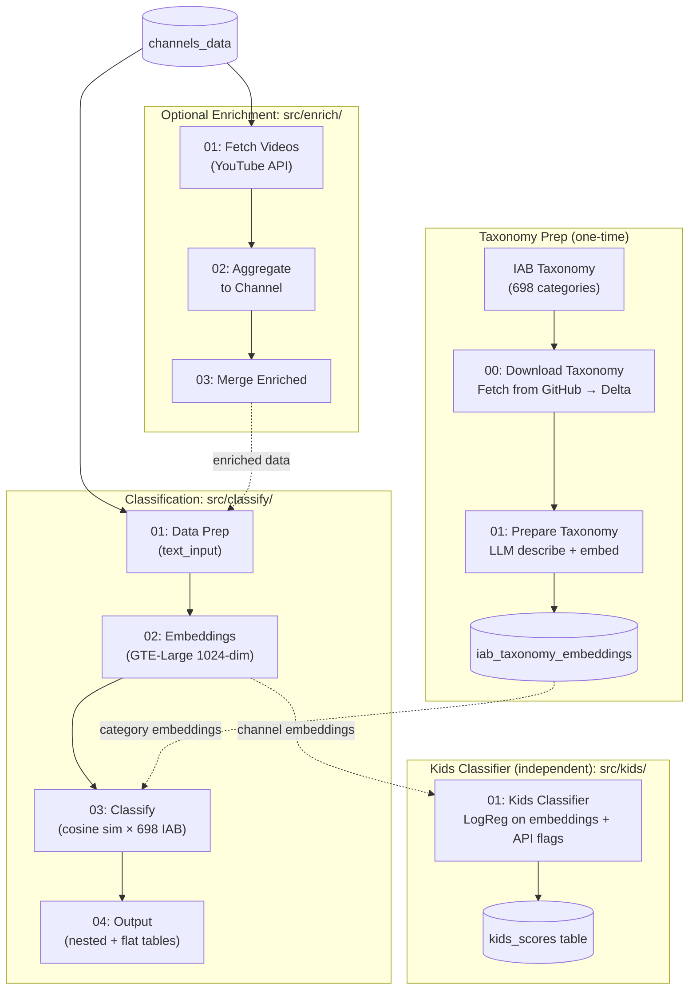

# Technical Guide: YouTube Channel Classification Pipeline

A detailed explanation of **how** and **why** this pipeline works — the ML approaches, trade-offs, alternatives considered, and tuning guidance. For setup and run instructions, see [README.md](README.md).

> **Looking for focused topic pages?** See the [docs/](docs/) folder for standalone explainers on [embeddings](docs/embeddings.md), [cosine similarity](docs/cosine-similarity.md), [IAB taxonomy](docs/iab-taxonomy.md), [multi-label classification](docs/multi-label-classification.md), [enrichment](docs/enrichment.md), [kids classifier](docs/kids-classifier.md), and [architecture](docs/architecture.md).

---

## Table of Contents

1. [Solution Overview](#1-solution-overview)
2. [Text Preprocessing — Building text_input](#2-text-preprocessing--building-text_input)
3. [Embeddings — Deep Dive](#3-embeddings--deep-dive)
4. [Load 0: IAB Taxonomy & Cosine Similarity Classification](#4-load-0-iab-taxonomy--cosine-similarity-classification)
5. [Load 1: KNN Refinement](#5-load-1-knn-refinement)
6. [Kids Classifier — Independent Semi-Supervised Approach](#6-kids-classifier--independent-semi-supervised-approach)
7. [Enrichment — Why Video-Level Data Helps](#7-enrichment--why-video-level-data-helps)
8. [Dev/Prod Mode — Testing and Scaling](#8-devprod-mode--testing-and-scaling)
9. [Scaling Considerations](#9-scaling-considerations)
10. [Future Improvements](#10-future-improvements)

---

## 1. Solution Overview

### The Problem

Given ~1.5 million YouTube channel metadata records, each channel needs topic labels (Sports, Gaming, Music, News, etc.) for brand-safety workflows — determining which channels are appropriate for ad placement. Manual review at this scale is infeasible. The existing YouTube API metadata (title, description, keywords, topicCategories) is sparse and inconsistent, making simple keyword matching unreliable.

### The Approach

We use **semantic embedding similarity** against the **IAB Content Taxonomy v3.0** — the industry-standard classification system for digital content used by ad exchanges, DSPs, and brand safety platforms. Each channel gets multiple category labels with confidence scores.

The classification runs in **two progressive stages**:

- **Load 0 (Semantic)** — pure cosine similarity between channel embeddings and IAB category embeddings. No labeled data. This is the primary signal and often enough on its own.
- **Load 1 (KNN Refinement)** — blends Load 0 with an empirical neighbor signal: look at previously high-confidence classified channels near the input and incorporate their labels as soft evidence. Improves accuracy for ambiguous channels without introducing drift.

**Core idea:** Embed both channel text and IAB category descriptions using the same model, then classify channels by cosine similarity to find the best-matching categories (Load 0). Optionally refine with K-nearest neighbors from the reference pool of already-confident classifications (Load 1). Both stages are multi-label — a tech review channel can be "Technology & Computing" and "Shopping > Product Reviews" simultaneously.

A separate, independent **Kids classifier** provides supplementary brand safety signals using semi-supervised learning on API flags.

### Three Pipelines

| Pipeline | When to Use | Input | What It Does |
|----------|-------------|-------|--------------|
| **classify-channels** | You already have channel metadata | CSV or Delta table | Taxonomy Prep → Text Prep → Embeddings → Classify (cosine sim) → Output |
| **enrich-and-classify** | Channel metadata is sparse, need richer signals | Any table with channel_id | Fetch top N videos/channel → Aggregate → Merge → then full classification |
| **kids-classifier** | Need Kids content detection for brand safety | Channel embeddings + raw data | Train LogReg on Kids labels → Score all channels |

The enrichment pipeline (`src/enrich/`) is optional. The Kids classifier (`src/kids/`) is independent. Both are packaged as DAB jobs in `databricks.yml`.

### End-to-End Architecture



---

## 2. Text Preprocessing — Building text_input

### What Goes In

Each channel's classifiable signal comes from concatenating four metadata fields into a single `text_input` string:

| Field | Source | Example | Signal Value |
|-------|--------|---------|-------------|
| `title` | Channel name | "CoComelon - Nursery Rhymes" | High — usually descriptive |
| `description` | Channel about section | "Educational nursery rhymes and songs for children..." | High — but often empty or boilerplate |
| `brandsettings_channel_keywords` | Creator-set keywords | "kids nursery rhymes learning songs" | Medium — when populated, very direct |
| `topicdetails_categories` | YouTube's auto-detected categories | "https://en.wikipedia.org/wiki/Entertainment" | Medium — reliable but coarse (parsed from Wikipedia URLs to plain names) |

### Why Concatenation Works

This is a **bag-of-signals** approach. Rather than engineering features from each field individually, we concatenate everything and let the embedding model figure out what matters. This works because:

1. **Embedding models handle variable-length text** — a short title and a long description both contribute proportionally
2. **Redundancy helps** — if the title says "cooking" and the keywords say "recipe chef food", the embedding reinforces that signal
3. **Missing fields degrade gracefully** — an empty description just means less signal, not broken input

### Cleaning Steps

```
Raw text → lowercase → remove URLs → remove special characters → collapse whitespace → trim
```

Each step has a purpose:

| Step | Why |
|------|-----|
| `lowercase` | "Gaming" and "gaming" should match |
| Remove URLs | Links add noise, not semantic content |
| Remove special chars | Emojis, brackets, pipes from keywords pollute embeddings |
| Collapse whitespace | Artifact cleanup after removals |

### What Gets Lost

- **Non-English text**: The embedding model (`databricks-gte-large-en`) is English-optimized. Japanese, Arabic, etc. channels produce lower-quality embeddings and may cluster by language rather than topic.
- **Emojis**: Stripped during cleaning, but some channels use emojis as primary descriptors (e.g., gaming channels).
- **Formatting and structure**: A description with bullet points vs. prose are treated identically.

### Impact of Sparse Data

Many channels have minimal metadata:

| Scenario | text_input Quality | Expected Classification Quality |
|----------|-------------------|-------------------------------|
| Title + description + keywords + topics | Excellent | High confidence |
| Title + description only | Good | Reliable for most topics |
| Title only | Weak | Low confidence, may misclassify |
| Title only + "null" everywhere | Very weak | Likely "Uncategorized" |

Channels with `text_length < 10` characters are filtered out entirely — there isn't enough signal to embed meaningfully. This is controlled by `MIN_TEXT_LENGTH` in config.

**This is why the enrichment pipeline exists**: video-level metadata (tags, descriptions, categories) fills in the gaps for channels with sparse metadata. See [Section 7](#7-enrichment--why-video-level-data-helps).

Note: enrichment is itself gated by Load 0 confidence — see the [enrichment policy](#enrichment-policy-quota-aware) in Section 7 for when to fetch videos.

---

## 3. Embeddings — Deep Dive

### What Embeddings Are

An embedding converts variable-length text (a channel's title + description + keywords) into a **fixed-length numeric vector** — specifically, an array of 1024 floating-point numbers. Two channels with similar text will produce similar vectors (close together in 1024-dimensional space).

**Analogy**: Think of channels as cities on a map. Cooking channels cluster in one region, gaming channels in another, and music channels in a third. The embedding model draws this map from the text — channels with similar meaning end up geographically close, even if they use different words ("recipe" and "cookbook" land near each other).

This numeric representation is what makes both classification and clustering possible: a classifier draws decision boundaries on this map, and clustering finds natural groupings of nearby points.

### Model Choice: `databricks-gte-large-en`

| Property | Value |
|----------|-------|
| **Model** | GTE-Large-EN (General Text Embeddings) |
| **Origin** | Alibaba DAMO Academy, hosted as Databricks Foundation Model |
| **Dimensions** | 1024 |
| **Language** | English-optimized |
| **Access** | `ai_query()` / Foundation Model API — no GPU cluster needed |

**Why this model:**

1. **Zero infrastructure**: Runs as a managed API endpoint on Databricks. No GPU clusters to provision, no model weights to manage, no CUDA drivers to debug.
2. **Quality**: GTE-Large consistently ranks in the top tier on text embedding benchmarks (MTEB). For our use case (short text classification), it produces well-separated topic clusters.
3. **Dimension balance**: 1024 dims is a sweet spot — enough to capture nuance across 18+ topics, not so large that KMeans suffers from the curse of dimensionality.
4. **Throughput**: The Foundation Model API handles batching (50 texts per call) with rate limiting built in.

### Alternative Embedding Model: `BAAI/bge-small-en-v1.5`

The pipeline includes a second option for GPU-equipped environments:

| Property | GTE-Large (FMAPI) | BGE-Small (self-hosted) |
|----------|--------------------|------------------------|
| Dimensions | 1024 | 384 |
| Compute | API calls (no GPU) | Requires GPU cluster |
| Cost model | Per-token API pricing | GPU cluster hours |
| Throughput | ~50 texts/batch, rate limited | ~256 texts/batch, limited by GPU memory |
| Quality | Higher | Slightly lower (but competitive) |
| Best for | < 500K channels or when GPU unavailable | > 500K channels with GPU budget |

Switch via `USE_FOUNDATION_MODEL_API = False` in config.

### Embeddings vs. Alternative Approaches

| Approach | How It Works | Pros | Cons | When to Use |
|----------|-------------|------|------|-------------|
| **Semantic Embeddings (our approach)** | Neural model converts text → dense vector capturing meaning | Captures synonyms and context; handles sparse/messy text well; general-purpose | Requires embedding model; higher compute than keyword methods | **Default** — best for diverse, real-world text |
| **TF-IDF** | Counts word frequencies, weights by document rarity | Simple, fast, no model needed; interpretable weights | Only matches exact words; misses "recipe" ≈ "cooking"; high-dimensional sparse matrix | Very large vocab, extremely low compute budget |
| **Bag of Words** | Counts word occurrences, no weighting | Simplest possible approach | Loses all semantics; no synonym handling; high dimensionality | Baseline sanity check only |
| **LLM Zero-Shot Classification** | Send each channel's text to an LLM with "classify this into one of: ..." | No training data needed; handles edge cases well; flexible categories | Extremely slow at 1.5M scale (~$15K+ API cost); inconsistent across runs; rate limits | Small-scale prototyping (< 10K channels) |
| **Fine-Tuned Classifier** | Train a model specifically on labeled examples for each category | Highest accuracy for known categories | Needs labeled training data for **every** category; expensive to maintain | When comprehensive labeled datasets exist |

### Key Trade-Off

Embeddings are a **middle ground** — more powerful than keyword matching (they understand that "recipe" and "cooking tutorial" are related), and vastly more scalable than running an LLM on every channel. The embedding model does the heavy semantic lifting once; downstream models (classifier, KMeans) just operate on the numeric vectors, which is computationally cheap.

---

## 4. Load 0: IAB Taxonomy & Cosine Similarity Classification

**Load 0** is the primary, purely-semantic classification stage. It uses no labeled data — only the similarity between a channel's embedding and the IAB category embeddings. Output is a ranked list of categories per channel with similarity scores, filtered by threshold.

### What is the IAB Content Taxonomy?

The **IAB (Interactive Advertising Bureau) Content Taxonomy v3.0** is the industry standard for categorizing digital content. It's maintained by the IAB Tech Lab and used by ad exchanges, DSPs, SSPs, and brand safety platforms worldwide.

**Structure:** ~698 categories across 4 tiers:

| Tier | Count | Example | Use |
|------|-------|---------|-----|
| Tier 1 | ~30 | Sports, Music, Technology & Computing | Broad targeting |
| Tier 2 | ~200 | Sports > Basketball, Technology > Smartphones | Category targeting |
| Tier 3 | ~300 | Sports > Extreme Sports > Skateboarding | Specific targeting |
| Tier 4 | ~20 | Music > Rock Music > Classic Rock | Very specific |

**Why IAB:**
1. **Industry standard** — Downstream ad systems already speak this taxonomy
2. **Comprehensive** — Covers all major content verticals including sensitive topics
3. **Hierarchical** — Supports both broad and specific classification
4. **Includes brand safety** — Sensitive Content Designations (SCD) flag risky categories
5. **Freely available** — CC-BY-3.0 license, machine-readable TSV from GitHub

### How the Classification Works

#### Step 1: Taxonomy Preparation (One-Time)

For each of the 698 IAB categories, we:

1. **Build the tier path** — e.g., `"Sports > Basketball > NBA"`
2. **Generate a rich description** using an LLM — e.g., *"Channels covering the National Basketball Association, including game highlights, player analysis, trade rumors, and fantasy basketball advice."*
3. **Embed the description** using the same model as channel embeddings (`databricks-gte-large-en`, 1024-dim)

The LLM descriptions are critical. Embedding just `"Basketball"` gives a weaker vector than embedding a 2-3 sentence description that captures the full semantic scope of the category. This is a one-time cost of ~698 LLM calls.

**Result:** `iab_taxonomy_embeddings` table — 698 rows, each with a 1024-dim vector.

#### Step 2: Cosine Similarity Scoring

For each channel, we compute cosine similarity against all 698 category embeddings:

```
similarity(channel, category) = dot(channel_vec, category_vec) / (||channel_vec|| × ||category_vec||)
```

This produces a 698-element score vector per channel. The computation is a matrix multiply:

```
Channel embeddings: (1.5M × 1024)
IAB category embeddings: (698 × 1024)   ← broadcast to all workers
Similarity matrix: (1.5M × 698)
```

**Implementation:** The 698 IAB embeddings (~2.7 MB) are broadcast to all Spark workers. A `pandas_udf` computes similarity for each partition independently — no data moves to the driver.

#### Step 3: Multi-Label Threshold Assignment

For each channel's 698-element score vector:

1. **Filter** — Keep all categories with similarity ≥ `SIMILARITY_THRESHOLD` (default 0.3)
2. **Sort** — Rank by similarity descending
3. **Cap** — Keep at most `MAX_CATEGORIES_PER_CHANNEL` (default 10)
4. **Primary** — The highest-scoring category becomes `primary_category`

```
Channel "MKBHD" (tech reviewer):
  Technology & Computing            → 0.78  ✓ (1st — primary)
  Technology > Consumer Electronics → 0.72  ✓
  Technology > Smartphones          → 0.65  ✓
  Shopping > Product Reviews        → 0.45  ✓
  Entertainment                     → 0.35  ✓
  Sports                            → 0.12  ✗ (below threshold)
  Food & Drink                      → 0.05  ✗
```

### Why Cosine Similarity over Other Approaches

| Approach | Scales to 1.5M? | Multi-label? | Cost | Quality | Our Choice |
|----------|:---:|:---:|------|---------|:---:|
| LLM per channel | No (1.5M calls) | Yes | ~$15K | Highest | |
| KMeans clustering | Yes | No (single cluster) | Free | Medium | |
| **Cosine similarity** | **Yes** | **Yes** | **Free** | **Good-High** | **✓** |
| Train classifier on LLM labels | Yes | Yes | ~$100 | High | |
| TF-IDF + keyword matching | Yes | Yes | Free | Low-Medium | |

**Key advantages:**
- **Zero per-channel inference cost** — All compute is matrix multiply on pre-computed embeddings
- **Multi-label native** — Threshold-based, not forced single assignment
- **Deterministic** — Same input always produces same output (unlike KMeans which depends on initialization)
- **Interpretable** — Confidence score is cosine similarity, a well-understood metric
- **Uses industry-standard taxonomy** — Output directly actionable for ad targeting

### Threshold Tuning

The `SIMILARITY_THRESHOLD` parameter controls the balance between coverage and precision:

| Threshold | Effect | When to Use |
|-----------|--------|-------------|
| 0.2 | Many categories per channel, some noise | Broad discovery, exploratory analysis |
| **0.3 (default)** | **Good balance of coverage and precision** | **General use** |
| 0.4 | Fewer, higher-confidence labels | High-precision targeting |
| 0.5 | Very selective, only strong matches | Brand safety (want to be sure) |

Monitor the `num_categories` distribution — if most channels have 0-1 categories, the threshold may be too high. If most have 8-10, it may be too low.

### Output Tables

**Nested table** (`channels_output`): One row per channel, `categories` as array of structs.

**Flat table** (`channels_classification_flat`): One row per channel-category pair — easy for SQL:

```sql
SELECT channel_id, channel_title, category_name, confidence
FROM channels_classification_flat
WHERE tier_path LIKE 'Sports%' AND confidence >= 0.5

-- Channels in both Gaming AND Music
SELECT a.channel_id FROM channels_classification_flat a
JOIN channels_classification_flat b ON a.channel_id = b.channel_id
WHERE a.tier_path LIKE 'Video Gaming%' AND b.tier_path LIKE 'Entertainment > Music%'
```

### Known Limitations

1. **English-centric** — The embedding model (`databricks-gte-large-en`) and LLM descriptions are English. Non-English channels will have lower similarity scores.
2. **Category description quality** — Classification quality depends on how well the LLM-generated descriptions capture each category's scope.
3. **Threshold sensitivity** — The threshold is a single global parameter. Some categories may need higher/lower thresholds than others.
4. **IAB gaps** — The IAB taxonomy is designed for general content. Some YouTube-specific categories (e.g., "ASMR", "Speedrunning") may not have direct matches.

---

## 5. Load 1: KNN Refinement

**Load 1** is an optional refinement stage that blends Load 0 scores with empirical evidence from previously-classified channels. Use it when Load 0 output is ambiguous (e.g., multiple categories scoring close to each other) and you want to bias toward labels that similar, high-confidence channels already carry.

> **Design principle:** KNN is a *supporting* signal, not a primary classifier. Load 0 remains the source of truth; Load 1 nudges close calls. This prevents weak labels from accumulating drift over successive runs.

### Why KNN Helps

Cosine similarity against 698 abstract taxonomy descriptions is powerful but coarse. Two channels in a narrow subgenre (e.g., "Formula 1 telemetry analysis" and "F1 strategy breakdowns") may have very similar channel embeddings yet produce near-tied Load 0 scores across `Auto Racing`, `Motorsports`, and `Sports > Auto Racing > Formula 1`. If one of them has already been classified with high confidence, that label is strong empirical evidence for the other.

### The KNN Reference Pool

Load 1 only uses **high-confidence** Load 0 outputs as neighbors — not every channel. Admission criteria:

| Criterion | Default | Rationale |
|---|---|---|
| Top Load 0 score | ≥ 0.75 | Only very-confident assignments count as "known truth" |
| Gap to 2nd score | ≥ 0.10 | The winner must be clearly ahead, not a near-tie |
| Stability across runs | Pass | (Optional) Same top category across the last N runs |

Channels that meet all three become members of the `knn_reference_pool`. Output table per run: `~5-15%` of total channels typically qualify. This pool is rebuilt after each Load 0 pass.

### Retrieval

For each channel being refined:

1. Find the top **K** nearest channels in the reference pool by embedding cosine similarity (default K = 25)
2. Collect each neighbor's assigned categories, weighted by similarity

### KNN Support Score

For a given category `k`, the support score is the similarity-weighted sum of neighbors that carry it:

```
knn_support(k) = Σ similarity_i  for neighbors assigned to category k
```

Weighting by similarity (not just counting votes) means close neighbors contribute more than distant ones. A neighbor at similarity 0.92 is worth ~5× a neighbor at 0.20.

### Blended Final Score

```
L1_score(k) = 0.75 × L0_score(k) + 0.25 × knn_support(k)
```

The 0.75 / 0.25 weighting keeps Load 0 dominant while letting KNN break ties and reinforce the right answer. Both components are normalized to the same scale before blending.

### Resolution Rules (Same as Load 0)

1. Rank categories by `L1_score`
2. Keep top 10 candidates
3. Apply threshold: `score >= 0.62 AND score >= best_score - 0.12`
4. Confidence gate:
   - If `score₁ - score₂ > 0.08` → publish 1 category (strong winner)
   - Else → publish up to 3 categories (multi-label)

### When Load 1 Changes the Answer

Load 1 typically changes the top category for ~5-15% of channels vs. Load 0 — the ambiguous middle. Load 0's strong winners pass through unchanged; Load 0's high-uncertainty cases get refined by the empirical signal. You can measure this delta via the `channel_candidates` table, which stores both `load_version = "l0"` and `load_version = "l1"` for each channel.

### Data Model

| Table | Columns | Purpose |
|---|---|---|
| `channel_candidates` | channel_id, category_id, score, rank, load_version | Full ranked list per channel per load — both L0 and L1 rows |
| `channel_final_labels` | channel_id, aboutness_labels (array), scores (array), confidence_bucket, load_version | Published labels after resolution (one row per channel per load) |
| `knn_reference_pool` | channel_id, embedding, assigned_categories, confidence_score | High-confidence pool used as KNN source |

### When to Use Load 1

| Scenario | Run Load 1? |
|---|---|
| First pass on fresh data — no reference pool yet | **No** — run Load 0 only, build the pool |
| Re-running after Load 0 has produced stable output | **Yes** — pool is populated, refinement is cheap |
| Channels with rich metadata already classifying confidently | Skip — Load 0 is enough |
| Small dataset (< 10K channels) | Skip — too little pool to support KNN meaningfully |
| Debugging a specific ambiguous channel | **Yes** — see how neighbors influence the answer |

In the pipeline, Load 1 is orchestrated by the `enrich-and-classify-v2` job, which chains: data-prep → embeddings → `03_classify_l0.py` → `03b_knn_pool.py` → `03c_classify_l1.py` → output. The `classify-channels-v2` job is Load 0 only.

### KNN Implementation Notes

- **Index**: the reference pool's embeddings are held in memory on workers (via broadcast) — a pool of ~100K channels at 1024 dims is ~400 MB, fits comfortably.
- **Metric**: cosine similarity on pre-normalized vectors → reduces to dot product.
- **K selection**: K = 25 is a sensible default. Too small (K = 5) is noisy; too large (K > 100) dilutes the signal toward global averages.
- **Approximation**: for very large pools (> 1M), swap exact KNN for Databricks Vector Search (IVFFlat or HNSW). The pipeline's KNN logic is pluggable.

---

## 6. Kids Classifier — Independent Semi-Supervised Approach

The Kids classifier is an **independent process** that runs separately from the main IAB classification pipeline. It trains a Logistic Regression model on embeddings using YouTube's `madeForKids` and `selfDeclaredMadeForKids` API flags as labels.

### Why It's Separate

1. **Different purpose** — IAB classification assigns topic categories; Kids detection is a brand safety signal
2. **Different data needs** — Kids classifier needs labeled data (API flags); IAB classification is unsupervised
3. **Different update cadence** — Kids labels may change as YouTube updates its flags; IAB categories are stable
4. **Composable** — Join the kids_scores table with any other output as needed

### How It Works

**Step 1: Build positive labels**

A channel is labeled "Kids" if **any** of these are true:
- Present in the seed list (if `USE_KIDS_SEED = True`)
- YouTube API `madeForKids` flag is `"true"`
- YouTube API `selfDeclaredMadeForKids` flag is `"true"`

**Step 2: Downsample negatives 2:1** — Prevents the model from learning "always predict non-Kids"

**Step 3: Train Logistic Regression** on pre-computed embedding vectors

**Step 4: Score all channels** via distributed `pandas_udf` — never collects full dataset to driver

### Why Logistic Regression

The embedding model already captures semantics. Kids channels form a distinct cluster in embedding space. LogReg just draws a hyperplane to separate them.

| Model | Accuracy | Training Time | Upgrade Value |
|-------|---------|---------------|---------------|
| **Logistic Regression** | High | Seconds | Baseline |
| XGBoost | Slightly higher | Minutes | Marginal |
| Neural Network | Marginally higher | Hours | Not worth it |

### Output

`kids_scores` table with `probability_kids` (0.0-1.0) and `predicted_kids` (0/1 at threshold 0.5).

Join with the main classification output:
```sql
SELECT o.*, k.probability_kids, k.predicted_kids
FROM channels_output o
LEFT JOIN kids_scores k ON o.channel_id = k.channel_id
```

---

## 7. Enrichment — Why Video-Level Data Helps

### The Problem with Channel-Level Metadata

Channel metadata is set once by the creator and often left incomplete:

| Field | Typical Population Rate | Issue |
|-------|------------------------|-------|
| `title` | ~99% | Usually populated but may be cryptic ("XxGamer99xX") |
| `description` | ~60-70% | Often empty, boilerplate, or social media links |
| `brandsettings_channel_keywords` | ~30-40% | Many creators never set keywords |
| `topicdetails_categories` | ~50-60% | YouTube's auto-detection is coarse and inconsistent |

When a channel has only a title and nothing else, the embedding is essentially a single phrase — not enough for reliable classification.

### What Video-Level Data Adds

Each video has its own independent metadata, often richer than the channel's:

| Signal | Source | Why It Helps |
|--------|--------|-------------|
| `video_tags` | Creator-set per video | Much more specific than channel keywords ("minecraft speedrun 1.20" vs. "gaming") |
| `video_description` | Per-video description | Usually more detailed than channel description |
| `category_id` | YouTube's per-video category (1-29) | Direct topic signal — YouTube categorizes every video |
| `made_for_kids` (per video) | Per-video flag | Catches Kids channels where channel-level flag is missing |
| `duration` | Video length | Short-form (< 60s) vs. long-form is a useful content signal |
| `topic_categories` | YouTube's per-video topic detection | More granular than channel-level topics |

### How Enrichment Works

1. **Fetch** top N videos per channel (configurable 1-50 via `videos_per_channel`) via PlaylistItems API → then Videos API for metadata
2. **Aggregate** to channel level: dominant category, top tags (top 50 by frequency), concatenated descriptions, engagement ratio, % kids videos
3. **Join** with existing channel metadata to create enriched `text_input`

### Cost Optimization: Cross-Channel Batching

The YouTube Videos API accepts up to 50 video IDs per call (1 quota unit). The pipeline collects video IDs across channels and batches them into shared API calls:

```
Cost formula per channel: 1 + (videos_per_channel / 50) API units
```

| `videos_per_channel` | Units/Channel | 1.5M Channels | Days @ 10K/day | Days @ 100K/day |
|---------------------|---------------|---------------|----------------|-----------------|
| 1 | 1.02 | 1.53M | 153 | 15 |
| 2 (default) | 1.04 | 1.56M | 156 | 16 |
| 5 | 1.10 | 1.65M | 165 | 17 |
| 10 | 1.20 | 1.80M | 180 | 18 |
| 25 | 1.50 | 2.25M | 225 | 23 |
| 50 | 2.00 | 3.00M | 300 | 30 |

Default daily quota is 10,000 units. Request an increase via the Google Cloud Console for enterprise-scale processing.

### When Enrichment Helps Most

| Scenario | Enrichment Value |
|----------|-----------------|
| Channel has empty description + no keywords | **High** — video data is the only text signal |
| Channel has sparse title like "XxGamer99xX" | **High** — video tags reveal the actual topic |
| Channel's madeForKids flag is missing | **Medium** — video-level flags can fill the gap |
| Channel already has rich description + keywords + topics | **Low** — additional data is redundant |

### When to Skip Enrichment

- If channel-level metadata is already well-populated (> 70% have description + keywords)
- If API quota is limited and classification without enrichment is acceptable
- For a quick first pass — run `classify-channels-v2` first, then selectively enrich poorly-classified channels

### Enrichment Policy (Quota-Aware)

Enrichment is expensive (YouTube API quota) and unnecessary for channels Load 0 already handles well. Gate enrichment on Load 0 confidence to save quota:

| Channel Type | Signal | Strategy |
|---|---|---|
| **High confidence** | Top L0 score ≥ 0.75 AND gap ≥ 0.10 | **No enrichment** — Load 0 is already decisive |
| **Ambiguous** | Top L0 score 0.5–0.75, or gap < 0.05 | Fetch top 2 videos, re-run classification on enriched text |
| **High-value** | In priority sample (e.g., top 100K by subscribers) | Always enrich, regardless of L0 confidence |
| **Low value** | Below priority threshold, L0 confidence low | Mark uncertain, skip enrichment |

At 1.5M channels with this policy, typical quota spend is ~30-50% of the naive "enrich everything" baseline.

**API discipline:**
- Avoid `search.list` (100 units/call) — use `channels.list` (1 unit) and `videos.list` (1 unit) only
- Batch up to 50 video IDs per `videos.list` call to minimize unit cost

---

## 8. Dev/Prod Mode — Testing and Scaling

### How It Works

A single `run_mode` parameter controls sample sizes, cluster counts, API quotas, and which channels to process. Set it three ways:

1. **Widget default** in `src/config.py`: `dbutils.widgets.text("run_mode", "dev")`
2. **DAB variable** in `databricks.yml`: set per target (dev, prod)
3. **CLI override**: `databricks bundle run classify-channels -t dev --params run_mode=prod`

### Dev Mode: Quick Validation

| Setting | Dev Value | Purpose |
|---------|-----------|---------|
| `DEV_CHANNEL_IDS` | CoComelon, MKBHD, MrBeast | 3 known channels for spot-checking |
| `SAMPLE_SIZE` | 10 | Process only 10 rows from CSV |
| `DAILY_QUOTA_LIMIT` | 200 | Stay within free developer API quota |

**Expected dev results:**
- CoComelon → Family and Relationships > Parenting (+ Genres > Family/Children)
- MKBHD → Technology & Computing > Consumer Electronics (+ multiple tech subcategories)
- MrBeast → Entertainment (+ Pop Culture, Video Gaming)

If these don't come out right, something is wrong with the pipeline before you scale to millions.

**Total dev cost:**
- Classification only: 0 API units (uses local data)
- Enrichment: ~4 API units (3 PlaylistItems calls + 1 Videos.list call)

### Prod Mode: Full Scale

| Setting | Prod Value | Purpose |
|---------|------------|---------|
| `DEV_CHANNEL_IDS` | `None` | Process all channels from source table |
| `SAMPLE_SIZE` | `None` | No sampling — process everything |
| `DAILY_QUOTA_LIMIT` | 10,000+ | Enterprise quota (request increase from Google) |
| `PRIORITY_SAMPLE_SIZE` | 100,000 | Process top 100K channels first by subscriber count |

### Switching from Dev to Prod

1. Verify dev results are correct (CoComelon → Kids, MKBHD → Tech, MrBeast → Entertainment)
2. Add a `prod` target in `databricks.yml` with `run_mode: prod` and appropriate catalog/schema
3. For enrichment: ensure YouTube API key is in Databricks secrets (`youtube/api_key`)
4. For enrichment: request enterprise API quota from Google if needed (default is 10K/day)
5. Deploy and run: `databricks bundle deploy -t prod && databricks bundle run classify-channels -t prod`

---

## 9. Scaling Considerations

### Spark Parallelism by Component

| Component | Execution Model | Distributed? | At 1.5M Channels |
|-----------|----------------|-------------|-------------------|
| **Taxonomy prep** | LLM calls + embedding on driver | No — but only ~698 calls (one-time) | Minutes |
| **Text preprocessing** | PySpark DataFrames + UDFs | Yes — fully parallel across workers | Minutes |
| **Embedding generation** | `pandas_udf` across partitions | Yes — each worker embeds its partition | Hours (FMAPI rate-limited) or minutes (GPU) |
| **Cosine similarity classification** | `pandas_udf` with broadcast IAB matrix | Yes — 698 IAB embeddings broadcast, each partition classifies independently | Minutes |
| **Kids classifier training** | sklearn on driver (downsampled training set only) | No — but training set is ~210K rows max after downsampling | Seconds |
| **Kids classifier scoring** | `pandas_udf` with broadcast model | Yes — model broadcast to workers, each partition scores independently | Minutes |
| **API enrichment** | Sequential on driver | No — intentional (single API key rate limits) | Days to months (quota-dependent) |
| **Aggregation & output** | PySpark groupBy, joins, writes | Yes — fully parallel | Minutes |

**Key design decisions:**
- **Classification at scale**: IAB category embeddings (698 × 1024 = ~2.7 MB) are broadcast once to all workers. Each partition independently computes cosine similarity — a simple matrix multiply. No data is collected to the driver.
- **Kids scoring at scale**: The Kids classifier is trained with sklearn on a small downsampled set (collected to driver), then the trained model is **broadcast** to all Spark workers via `pandas_udf`.
- **API enrichment stays sequential**: Distributing YouTube API calls across workers with a single API key would cause rate-limit errors (403s). The bottleneck is quota (10K units/day), not compute. For higher throughput, use multiple API keys with partitioned channel lists.

### Recommendations by Scale

| Data Size | Embedding Model | Classification | API Enrichment |
|-----------|----------------|---------------|---------------|
| < 10K channels | FMAPI (simplest) | Cosine similarity (instant) | Full enrichment feasible (< 10K API units) |
| 10K - 100K | FMAPI or GPU | Cosine similarity (minutes) | Selective enrichment (top channels by subscribers) |
| 100K - 1M | GPU recommended (cost) | Cosine similarity (minutes) | Priority sampling + incremental checkpointing |
| 1M+ | GPU required (rate limits) | Cosine similarity (minutes) | Enterprise API quota required; enrich in batches over days |

### Embedding Generation at Scale

The Foundation Model API has per-minute rate limits. At 1.5M channels:
- **FMAPI**: Rate-limited to ~1000-5000 embeddings/minute depending on account. At 1000/min → 25 hours. At 5000/min → 5 hours.
- **Self-hosted GPU**: `bge-small-en-v1.5` on 4× A10G processes ~5000 texts/second with batch_size=256. 1.5M channels → ~5 minutes of pure compute, plus cluster startup time.

For > 500K channels, the GPU path is typically more cost-effective despite the cluster overhead.

### Incremental Processing

The enrichment pipeline includes a **checkpoint table** that tracks which channels have already been processed. If a run fails (quota exhausted, cluster timeout), restart the notebook and it resumes from where it left off — no duplicate API calls, no duplicate rows. The pipeline is packaged as a DAB job, enabling automated scheduled runs for incremental enrichment.

---

## 10. Future Improvements

### Multilingual Embeddings
The current model (`databricks-gte-large-en`) is English-optimized. Non-English channels produce lower-quality embeddings. Switching to a multilingual model (e.g., `multilingual-e5-large`) would improve classification for Spanish, Japanese, Arabic, and other language channels — important for a global 1.5M channel dataset.

### Visual Analysis
Channel thumbnails and video thumbnails carry strong topic signals (a gaming channel's thumbnails look very different from a cooking channel's). A vision model (e.g., CLIP) could generate visual embeddings to complement text embeddings, especially for channels with sparse text metadata.

### Active Learning Loop
Currently, the pipeline is run once and outputs a static classification. An active learning approach would:
1. Surface the lowest-confidence channels for human review
2. Feed human corrections back into the classifier training set
3. Retrain and re-score — each cycle improves accuracy

This turns the pipeline from a one-shot tool into a continuously improving system.

### Temporal Topic Drift
Channels change topics over time — a channel that was "gaming" in 2020 might pivot to "crypto" in 2023. Tracking topic assignments over time (with `run_timestamp` versioning) and flagging significant changes would alert downstream systems to channels that may need reclassification.

### Enhanced Cluster Representation
Current LLM auto-labeling sends 8 sample descriptions per cluster. Adding **TF-IDF top keywords** (computed across the full cluster) to the LLM prompt would give it a more representative view, improving label accuracy for large, diverse clusters.

### Category Prototypes (Load 2)
Load 0 compares against a single LLM-generated description per IAB category. **Category prototypes** would compute a centroid embedding per category from the Load-1 high-confidence pool — a "learned" representation of what a category actually looks like in this channel dataset, not just the abstract LLM description.

The scoring formula extends to three components:

```
L2_score(k) = 0.60 × L0_score(k) + 0.15 × knn_support(k) + 0.25 × prototype_score(k)
```

`prototype_score(k)` is cosine similarity between the channel embedding and the category's centroid. This captures dataset-specific patterns (e.g., "what gaming channels on *this* platform look like") that the abstract LLM description misses. Adds drift risk — centroids need to be rebuilt periodically as the dataset grows.

### LLM Re-ranking for Ambiguous Cases
For channels that remain ambiguous after Load 1, a final LLM pass could examine the top 5 candidates and the channel's text to pick the best label. Expensive per call, but applied only to the ambiguous tail (~1-5% of channels), the total cost is bounded.

### Category-Specific Thresholds
The single global threshold (0.3) works well on average but under/over-fits specific categories. Per-category thresholds — calibrated from a small labeled sample — would improve precision without sacrificing recall.
