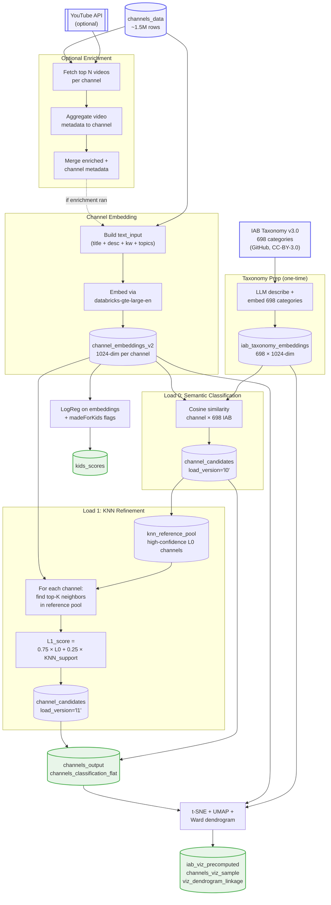
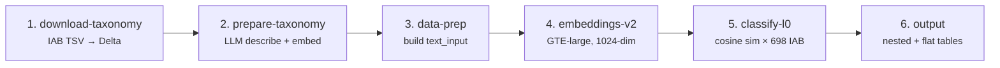
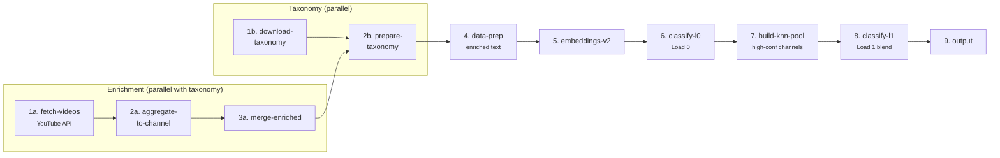
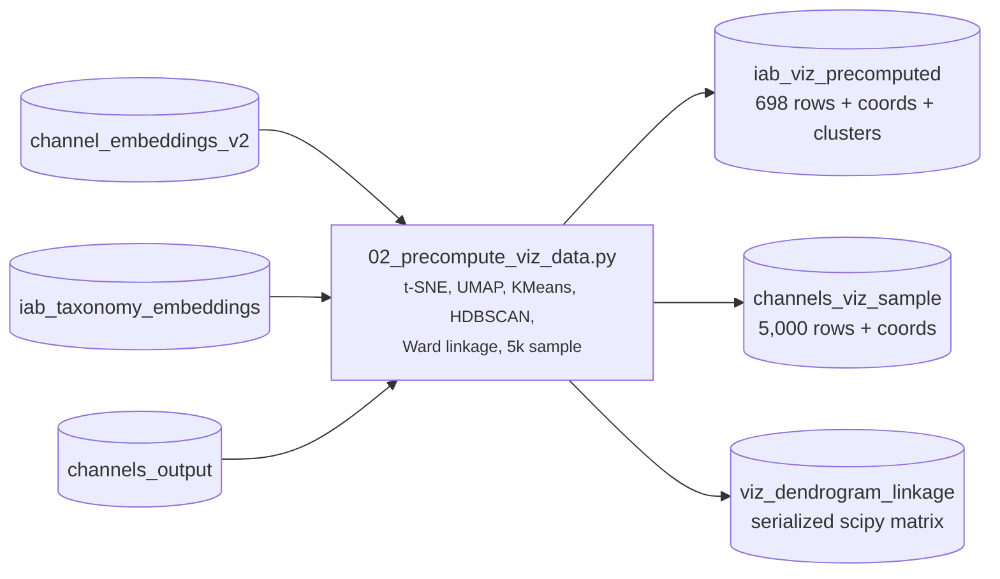
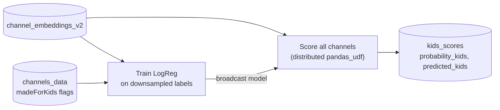

# Pipeline Architecture

## Overview

The pipeline is built on Databricks with PySpark, packaged as a **Databricks Asset Bundle (DAB)** for one-command deployment. It ships as **four jobs** that share configuration and infrastructure, composed progressively (Load 0 only → Load 0 + Load 1 → viz tables → Kids signal).

| Job | Purpose | YouTube API? |
|---|---|---|
| `classify-channels-v2` | Load 0 only — fast semantic classification | No |
| `enrich-and-classify-v2` | Full pipeline: enrichment + Load 0 + Load 1 KNN refinement | Yes |
| `precompute-viz` | Build t-SNE/UMAP/dendrogram tables for the Embeddings Explorer app | No |
| `kids-classifier` | Independent brand-safety signal (`probability_kids`) | No |

All jobs share the same catalog/schema (default `main.youtube_channels`) and can run in any order after an initial pass.

---

## End-to-End Data Flow

The big picture: sources at top, embedding generation in the middle, two classification stages (Load 0 and Load 1) feeding into published labels. KNN pool and Kids classifier are independent downstream consumers of embeddings.



---

## Job 1: `classify-channels-v2` (Load 0 only)

Use this for a fast pass with no YouTube API dependency. Produces ranked IAB categories via pure semantic similarity.



**6 tasks, sequential.** Typical runtime on 100K channels: ~15 minutes (FMAPI-bound during embedding).

| Task | Script | Input | Output |
|---|---|---|---|
| 1. download-taxonomy | `src/taxonomy/00_download_taxonomy.py` | IAB GitHub TSV | `iab_taxonomy_raw`, `iab_taxonomy` |
| 2. prepare-taxonomy | `src/taxonomy/01_prepare_taxonomy.py` | `iab_taxonomy` | `iab_taxonomy_embeddings` |
| 3. data-prep | `src/classify/01_data_prep.py` | `channels_data` | `channels_prepped` |
| 4. embeddings-v2 | `src/classify/02_embeddings_v2.py` | `channels_prepped` | `channel_embeddings_v2` |
| 5. classify-l0 | `src/classify/03_classify_l0.py` | embeddings + taxonomy embeddings | `channel_candidates` (load_version='l0') |
| 6. output | `src/classify/04_output.py` | `channel_candidates` | `channels_output`, `channels_classification_flat` |

Run:
```bash
databricks bundle run classify-channels-v2 -t dev -p <profile>
```

---

## Job 2: `enrich-and-classify-v2` (Load 0 + Load 1, with YouTube API)

Full pipeline. Fetches video metadata first for richer channel text, then runs Load 0 and Load 1 KNN refinement.



**~11 tasks** (enrichment and taxonomy prep run in parallel, then converge). Typical runtime depends heavily on YouTube API quota — sequential API calls are the bottleneck at scale.

| Task | Script | Purpose |
|---|---|---|
| 1a. fetch-videos | `src/enrich/01_fetch_video_metadata.py` | YouTube API: top N videos per channel |
| 2a. aggregate-to-channel | `src/enrich/02_aggregate_to_channel.py` | Sum tags, descriptions, categories per channel |
| 3a. merge-enriched | `src/enrich/03_merge_enriched.py` | Join enriched data into master table |
| 1b. download-taxonomy | `src/taxonomy/00_download_taxonomy.py` | (Same as Job 1) |
| 2b. prepare-taxonomy | `src/taxonomy/01_prepare_taxonomy.py` | (Same as Job 1) |
| 4. data-prep | `src/classify/01_data_prep.py` | Uses `data_source_override` → enriched table |
| 5. embeddings-v2 | `src/classify/02_embeddings_v2.py` | Embed enriched text |
| 6. classify-l0 | `src/classify/03_classify_l0.py` | Load 0 semantic classification |
| 7. build-knn-pool | `src/classify/03b_knn_pool.py` | Extract high-confidence channels → `knn_reference_pool` |
| 8. classify-l1 | `src/classify/03c_classify_l1.py` | Blend L0 + KNN neighbor votes → `channel_candidates` (load_version='l1') |
| 9. output | `src/classify/04_output.py` | Final published tables |

Run:
```bash
databricks bundle run enrich-and-classify-v2 -t dev -p <profile>
```

**Prerequisite:** a YouTube Data API v3 key stored in a Databricks secret scope (name configured in `src/config.py`).

---

## Job 3: `precompute-viz`

Produces the tables the companion [Embeddings Explorer app](../../embeddings-explorer/) reads at runtime. Run this **after** Job 1 or 2 has produced classified output.



Run:
```bash
databricks bundle run precompute-viz -t dev -p <profile>
```

---

## Job 4: `kids-classifier` (Independent)

Supplementary brand-safety signal. Runs independently once channel embeddings exist.



---

## Project Structure

```
youtube-channel-classification/
├── databricks.yml                          # DAB bundle: 4 jobs
├── README.md                               # Overview + quick start
├── TECHNICAL_GUIDE.md                      # Comprehensive technical reference
├── docs/                                   # Focused documentation pages
├── data/
│   ├── iab_content_taxonomy_3.0.tsv        # IAB taxonomy (CC-BY-3.0)
│   └── channels_data_sample.csv            # 20-row schema sample
├── src/
│   ├── config.py                           # All configuration (widgets, tables, params)
│   ├── taxonomy/
│   │   ├── 00_download_taxonomy.py         # Download IAB TSV from GitHub → Delta
│   │   └── 01_prepare_taxonomy.py          # LLM describe → embed → Delta
│   ├── classify/
│   │   ├── 01_data_prep.py                 # Combine text fields, clean, filter
│   │   ├── 02_embeddings_v2.py             # Embed channels (distributed pandas_udf)
│   │   ├── 03_classify_l0.py               # Load 0: pure semantic similarity
│   │   ├── 03b_knn_pool.py                 # Build high-confidence reference pool
│   │   ├── 03c_classify_l1.py              # Load 1: blend L0 + KNN neighbor votes
│   │   └── 04_output.py                    # Nested + flat output tables
│   ├── enrich/
│   │   ├── 01_fetch_video_metadata.py      # YouTube API: top N videos per channel
│   │   ├── 02_aggregate_to_channel.py      # Aggregate video → channel level
│   │   └── 03_merge_enriched.py            # Merge enriched + channel metadata
│   ├── kids/
│   │   └── 01_kids_classifier.py           # Independent kids content classifier
│   └── explore/
│       ├── 01_explain_classification.py    # Interactive: explain a channel's labels
│       └── 02_precompute_viz_data.py       # Produces viz tables for the app
```

---

## Tables

All tables live in Unity Catalog under `{catalog}.{schema}` (default `main.youtube_channels`).

### Taxonomy tables
| Table | Created by | Description |
|---|---|---|
| `iab_taxonomy_raw` | `00_download_taxonomy.py` | Raw IAB taxonomy (698 rows) |
| `iab_taxonomy` | `01_prepare_taxonomy.py` | Taxonomy with LLM-generated descriptions |
| `iab_taxonomy_embeddings` | `01_prepare_taxonomy.py` | Category embeddings (698 × 1024) |

### Channel & classification tables
| Table | Created by | Description |
|---|---|---|
| `channels_prepped` | `01_data_prep.py` | Cleaned `text_input` per channel |
| `channel_embeddings_v2` | `02_embeddings_v2.py` | Channel embedding vectors |
| `channel_candidates` | `03_classify_l0.py` / `03c_classify_l1.py` | Ranked categories per channel, per load (columns include `load_version`) |
| `knn_reference_pool` | `03b_knn_pool.py` | High-confidence L0 channels used as KNN source |
| `channel_final_labels` | `03c_classify_l1.py` | Published labels after resolution |
| `channels_output` | `04_output.py` | Final nested output (1 row per channel) |
| `channels_classification_flat` | `04_output.py` | Flat output (1 row per channel-category) |

### Enrichment tables
| Table | Created by | Description |
|---|---|---|
| `raw_video_metadata` | `01_fetch_video_metadata.py` | Raw video API responses |
| `channels_enriched` | `02_aggregate_to_channel.py` | Aggregated video signals per channel |
| `channels_enriched_combined` | `03_merge_enriched.py` | Merged channel + video metadata |
| `enrichment_checkpoint` | `01_fetch_video_metadata.py` | Resume tracking for API calls |

### Kids + viz tables
| Table | Created by | Description |
|---|---|---|
| `kids_scores` | `01_kids_classifier.py` | probability_kids + predicted_kids |
| `iab_viz_precomputed` | `02_precompute_viz_data.py` | 698 IAB points + 3D coords + cluster labels |
| `channels_viz_sample` | `02_precompute_viz_data.py` | 5,000 channel points + 3D coords |
| `viz_dendrogram_linkage` | `02_precompute_viz_data.py` | Serialized scipy Ward linkage |

---

## Configuration

All parameters live in `src/config.py`, driven by Databricks widgets. DAB jobs pass values via `base_parameters`; interactive notebook use falls back to widget defaults.

Key parameters: `catalog`, `schema`, `run_mode` (dev/prod), `videos_per_channel`, `data_source_override`, `csv_filename`.

See [README.md](../README.md#configuration) for the full configuration reference.

---

## Scaling

| Component | Distributed? | Notes at 1.5M channels |
|---|:---:|---|
| Taxonomy prep | No (698 LLM calls) | Minutes — one-time |
| Data prep | Yes (PySpark) | Minutes |
| Embeddings | Yes (`pandas_udf` + batched FMAPI) | Hours at FMAPI rate limits; minutes on a GPU cluster |
| Load 0 classification | Yes (`pandas_udf` + broadcast taxonomy matrix) | Minutes |
| KNN pool build | Yes (PySpark filter + write) | Minutes |
| Load 1 classification | Yes (`pandas_udf` + broadcast pool embeddings) | Minutes for exact KNN; seconds with Vector Search |
| Output | Yes (PySpark joins + writes) | Minutes |
| Enrichment | No (single API key, sequential on driver) | Days-weeks, quota-dependent |
| Kids training | No (sklearn on driver, downsampled) | Seconds |
| Kids scoring | Yes (`pandas_udf` + broadcast model) | Minutes |
| Viz precompute | No (t-SNE/UMAP on driver, 5k sample) | Minutes |

**Key design decisions:**
- **Taxonomy broadcast:** 698 × 1024 ≈ 2.7 MB, broadcast once to all workers for Load 0.
- **Reference-pool broadcast:** the full pool (~100-300K channels, 400 MB-1.2 GB at 1024 dims) is broadcast for Load 1 exact KNN. Swap for Vector Search if pool exceeds memory.
- **Enrichment stays sequential:** distributing YouTube API calls across workers with a single key causes rate-limit errors. Quota is the bottleneck, not compute.
- **Idempotency:** each job's output tables are overwritten (or merged) on re-run — safe to re-trigger.

See [TECHNICAL_GUIDE.md §9](../TECHNICAL_GUIDE.md#9-scaling-considerations) for deeper scaling guidance.
