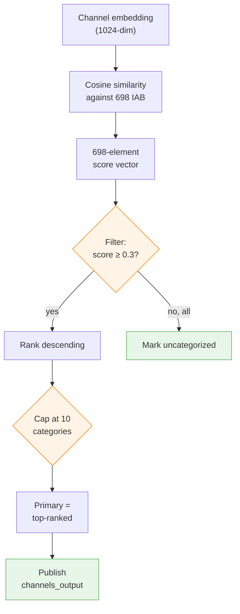

# Cosine Similarity

Cosine similarity is **the core operation** of the Load 0 classifier in this pipeline. Every classification decision ultimately flows from one question: "how similar, in direction, is this channel's embedding to this category's embedding?"

This page goes deep on what cosine similarity is, why we chose it, how we compute it at scale, and what its failure modes look like. If you only read one doc to understand the ML side of this pipeline, read this one.

---

## TL;DR

- Two vectors, output a number between **-1 and +1**.
- **+1** = same direction (meaning); **0** = unrelated; **-1** = opposite (rare in embeddings, close to 0 is the typical "unrelated" case).
- Measures **angle**, not length. A channel with a long description and one with a short description can still score equally high.
- Fast: once vectors are unit-normalized, it's just a dot product. At scale, it's a matrix multiply.
- In this pipeline: for each of ~1.5M channels, we compute it against all 698 IAB category embeddings — a single `(1.5M × 1024) @ (698 × 1024)ᵀ` matmul.

---

## Geometric intuition

Embeddings live in a very high-dimensional space (1024 dimensions here). You can't picture that directly, but the math is identical to 2D or 3D — so picture those.

Imagine every channel and every IAB category as an arrow pointing out from the origin. Cosine similarity asks: **how wide is the angle between these two arrows?**

```
           "Basketball" category
              ↗
             /
            /  θ = 18°   → cos(18°) ≈ 0.95   ✓ strong match
           /
          /  ← NBA highlights channel
         ────────────────────────────

           "Basketball" category
              ↗
             /
            /
           /  θ = 70°   → cos(70°) ≈ 0.34   — weak match
          /
         / . . . . . . "Gaming reviews" channel
         ────────────────────────────

           "Basketball" category
              ↗   "Cooking" channel
             /   ↘
            /    ↘
           / 135°  ↘    → cos(135°) ≈ -0.71   opposing meaning (rare)
          /        ↘
         ────────────────────────────
```

**Key mental model:** direction = meaning, length = intensity. Cosine similarity throws away length so that a tersely-described tech channel and a verbosely-described tech channel can still match the "Technology" category equally well — they *mean* the same thing.

---

## The math, from scratch

### Step 1 — the dot product

For two vectors **a** and **b** of length *n*:

```
dot(a, b) = a₁·b₁ + a₂·b₂ + ... + aₙ·bₙ
```

The dot product is biased by vector magnitude: two long vectors pointing similar directions score higher than two short vectors pointing identical directions. That's a problem if you only care about direction.

### Step 2 — normalize by magnitude

The magnitude (L2 norm) of a vector is its length:

```
‖a‖ = sqrt(a₁² + a₂² + ... + aₙ²)
```

Divide the dot product by both vectors' magnitudes, and you get cosine similarity:

```
cos(θ) = dot(a, b) / (‖a‖ × ‖b‖)
```

This is exactly the cosine of the angle between **a** and **b**. By construction it's in [-1, 1].

### Step 3 — pre-normalize to skip division every time

If we normalize every vector to unit length **once** (divide each component by the magnitude), then every subsequent cosine similarity becomes just a dot product:

```
â = a / ‖a‖           # unit vector, ‖â‖ = 1
b̂ = b / ‖b‖

cos(θ) = dot(â, b̂)    # because both denominators are 1
```

**This is what the pipeline does.** All channel and taxonomy embeddings are pre-normalized before storage. At scoring time, cosine similarity is a plain matrix multiply — no division, no square roots.

---

## A tiny numerical example

Three toy 3D vectors (imagine them as "tech", "sports", "cooking" axes):

```
NBA-highlights channel    = [0.1, 0.9, 0.1]
IAB "Basketball"          = [0.0, 1.0, 0.0]
IAB "Food & Cooking"      = [0.0, 0.0, 1.0]
```

**Dot products:**
```
dot(nba, basketball) = 0.1·0.0 + 0.9·1.0 + 0.1·0.0 = 0.9
dot(nba, cooking)    = 0.1·0.0 + 0.9·0.0 + 0.1·1.0 = 0.1
```

**Magnitudes:**
```
‖nba‖        = sqrt(0.01 + 0.81 + 0.01) = sqrt(0.83) ≈ 0.911
‖basketball‖ = 1.0  (already unit length)
‖cooking‖    = 1.0
```

**Cosine similarities:**
```
cos(nba, basketball) = 0.9 / (0.911 × 1.0) ≈ 0.988    ✓ very strong match
cos(nba, cooking)    = 0.1 / (0.911 × 1.0) ≈ 0.110    ✗ clearly unrelated
```

At 1024 dimensions with a trained embedding model the numbers look less clean, but the mechanic is identical.

---

## Why cosine, not Euclidean distance

| Metric | What it measures | Behavior at 1024 dims |
|---|---|---|
| **Cosine similarity** | Angle between vectors (direction only) | Stable — captures semantic similarity regardless of magnitude |
| Euclidean distance | Straight-line distance | **Breaks** — all points become ~equidistant (curse of dimensionality) |
| Manhattan distance | Sum of per-axis differences | Same curse — gets noisy fast |
| Dot product (un-normalized) | Direction × magnitude | Biased toward longer vectors |

Cosine is the standard for comparing text embeddings because:
1. **Magnitude invariance** — a long document and a short one about the same topic should match
2. **Works in high dimensions** where Euclidean distance collapses
3. **Fast** after pre-normalization (reduces to dot product)
4. **Interpretable** — the score has a clear geometric meaning

---

## From similarity to classification

Scoring a channel against 698 categories produces a 698-element vector of similarities. Turning that into labels is a 3-step decision:



In Load 1, a second scoring happens after KNN blending — see [TECHNICAL_GUIDE.md §5](../TECHNICAL_GUIDE.md#5-load-1-knn-refinement).

---

## Interpreting scores

What a score *means* is model-dependent, but `databricks-gte-large-en` produces fairly calibrated magnitudes. Typical ranges:

| Score | Meaning | Example |
|---|---|---|
| **0.70 – 1.00** | Very strong match | MKBHD → "Technology & Computing" (0.78) |
| **0.50 – 0.70** | Good match | MKBHD → "Technology > Consumer Electronics" (0.72) |
| **0.30 – 0.50** | Moderate match | MKBHD → "Shopping > Product Reviews" (0.45) |
| **0.10 – 0.30** | Weak match | Below default threshold — generally noise |
| **< 0.10** | Unrelated | MKBHD vs "Food & Drink" |

### What a healthy score distribution looks like

Across a large channel set, Load 0 top-category scores tend to look like this (sketch):

```
count
  │
  │                        ▄▄
  │                      ▄▄███▄
  │                     ▄██████▄
  │                    ▄████████▄▄
  │                   ▄██████████▄▄
  │                 ▄▄█████████████▄▄
  │              ▄▄███████████████████▄
  │        ▄▄▄▄██████████████████████████▄▄▄
  └──────┬──────┬──────┬──────┬──────┬──────┬──── score
        0.1   0.2    0.3    0.4   0.5    0.6    0.7
                ↑
           threshold
```

- **Mode near 0.4-0.5**: most channels clearly match at least one category
- **Long right tail to 0.8+**: high-confidence, unambiguous channels
- **Left tail below 0.3**: sparse-metadata channels that can't be classified

**Red flags in your distribution:**
| Pattern | Likely cause |
|---|---|
| Mass mode at < 0.3 | Text_input is too sparse/noisy; embedding is weak |
| Very narrow distribution (all 0.35-0.45) | Category descriptions too generic; not discriminating |
| Bi-modal (peaks at 0.2 and 0.6) | Two populations — probably language mix or different content types |

---

## The scale story: matrix multiply

At 1.5M channels × 698 categories, you do **1.047 billion** cosine similarity computations per run. That sounds like a lot, but it's trivial when cast as a matrix multiply:

```
Channel embeddings:      ┌─────────────────────┐
(1.5M × 1024)            │                     │
                         │                     │
                         │      1.5M × 1024    │
                         │     (≈ 6 GB fp32)   │
                         │                     │
                         └─────────────────────┘
                                    ·
                                    (matmul)
                                    ·
Category embeddings:     ┌──────────────┐
(698 × 1024)             │  698 × 1024  │    ← broadcast to all
transposed to            │ (≈ 2.7 MB)   │      workers, held in
(1024 × 698)             └──────────────┘      memory

                                    ↓

Similarity matrix:       ┌──────────────┐
(1.5M × 698)             │              │
                         │   1.5M × 698 │
                         │  (≈ 4 GB fp32)│    ← never materialized
                         │              │      — computed partition
                         └──────────────┘      by partition

```

This is exactly one `BLAS GEMM` call per Spark partition. Modern CPUs do it at hundreds of GFLOPS; an entire partition of ~50K channels scores in < 1 second.

---

## Distributed computation in the pipeline

```python
# Pseudocode — src/classify/03_classify_l0.py

# 1. Load + broadcast taxonomy (once)
iab_matrix = spark.table(IAB_EMBEDDINGS).toPandas()[["embedding"]]
iab_matrix = np.stack(iab_matrix.values)           # (698, 1024)
iab_matrix = iab_matrix / norm(iab_matrix, axis=1, keepdims=True)  # unit vectors
bc_iab = spark.sparkContext.broadcast(iab_matrix)  # (698, 1024) to every worker

# 2. pandas_udf runs per partition on workers — no data returns to driver
@pandas_udf("array<struct<iab_id:string, score:float>>")
def classify_batch(embeddings: pd.Series) -> pd.Series:
    M = np.stack(embeddings.values)                # (N, 1024)
    M = M / norm(M, axis=1, keepdims=True)         # unit vectors
    S = M @ bc_iab.value.T                         # (N, 698) — the matmul
    return pd.Series([top_k(row, threshold=0.3, k=10) for row in S])
```

**Why `pandas_udf`, not `udf`:** the pandas version hands each partition to NumPy as a block and calls BLAS. A scalar Python UDF would loop per row in Python, which is ~100× slower.

**Why broadcast, not join:** joining 1.5M × 698 = 1 billion rows would be the wrong shape (one row per (channel, category) pair). Broadcasting keeps the taxonomy tiny (2.7 MB) on every worker so each partition scores independently against the full category set.

---

## Threshold tuning

The `SIMILARITY_THRESHOLD` parameter (default 0.3) is the single biggest knob:

| Threshold | Effect | When to use |
|---|---|---|
| 0.2 | Many categories per channel, some noise | Broad discovery / exploratory analysis |
| **0.3 (default)** | **Good balance of coverage + precision** | **General use** |
| 0.4 | Fewer, higher-confidence labels | High-precision targeting |
| 0.5 | Very selective, only strong matches | Brand safety (want to be sure) |

**How to tune it:**
1. Run Load 0 on a sample (10k channels)
2. Plot the `num_categories` distribution
3. If most channels have 0-1 categories → threshold is too high; lower it
4. If most have 8-10 categories → threshold is too low; raise it
5. For production, calibrate against 100-200 hand-labeled channels and optimize F1

See also the gap-based multi-label rule in [TECHNICAL_GUIDE.md §4](../TECHNICAL_GUIDE.md#4-load-0-iab-taxonomy--cosine-similarity-classification).

---

## Caveats and edge cases

Cosine similarity is great, but it has known pathologies:

### 1. Hubness
In high dimensions, certain embedding directions become "popular" — they're close to many unrelated things. A channel might score 0.4 against every category, not because it's a generalist but because the model put its embedding near a hub point. Mitigation: **look at the score gap, not the absolute score**. If top-1 is 0.45 and top-2 is 0.44, the answer is noisy regardless of the absolute number.

### 2. Anisotropy
Transformer-based embeddings (like GTE) cluster in a narrow cone of the 1024-dim space — they're not uniformly distributed. This compresses the usable similarity range: "unrelated" pairs may sit at 0.2-0.3 instead of 0.0. The pipeline's thresholds (0.3 default) account for this. If you swap models, re-calibrate.

### 3. Short-text instability
A channel with a 5-word title and no description produces a noisy embedding. Small changes in text ("tech reviews" → "tech reviewer") can swing top-1 by 0.05+. Enrichment (video metadata) specifically addresses this.

### 4. Directional bias
The IAB categories have one LLM-generated description each. If the description is poorly-worded, the embedding points in a slightly off direction, and all channels in that category score systematically lower. Fix: regenerate descriptions with a better prompt, or use multiple descriptions per category and average (the category prototype concept — see [Future Improvements](../TECHNICAL_GUIDE.md#10-future-improvements)).

### 5. Not transitive
`cos(A, B) = 0.8` and `cos(B, C) = 0.8` does **not** imply `cos(A, C) ≥` anything. Unlike distances, similarity doesn't obey the triangle inequality. KNN retrieval handles this correctly by recomputing similarity for every pair.

---

## Optimization tips

For most workloads the pipeline's approach (broadcast matmul) is already near-optimal. Things to know when you push past 10M channels:

| Problem | Technique | Typical speedup |
|---|---|---|
| Exact KNN on > 1M channels is slow | Approximate KNN (HNSW, IVFFlat) via Databricks Vector Search | 10-100× |
| Repeated queries against the same taxonomy | FAISS index on the 698 category vectors | 2-5× for small-batch scoring |
| Memory-bound matmul (fp32) | Use fp16 or int8 quantization | ~2× memory, 1.5× speed |
| Storage bloat from 1024-dim floats | Reduce to 256 dims via PCA or train a smaller distilled model | 4× storage, minor accuracy loss |
| Re-running on new channels only | Delta table merge + `WHERE channel_id NOT IN (processed)` | Linear in new data only |

For the current scale (1.5M channels), none of this is necessary — exact cosine via matmul runs in minutes.

---

## Related reading

- [Embeddings](embeddings.md) — how text becomes a 1024-dim vector in the first place
- [Multi-label classification](multi-label-classification.md) — how scores become published labels
- [IAB Taxonomy](iab-taxonomy.md) — what we're scoring against
- [TECHNICAL_GUIDE.md §4](../TECHNICAL_GUIDE.md#4-load-0-iab-taxonomy--cosine-similarity-classification) — full Load 0 walkthrough with SQL output examples
- [TECHNICAL_GUIDE.md §5](../TECHNICAL_GUIDE.md#5-load-1-knn-refinement) — how Load 1 uses cosine similarity a second time, on the channel-to-channel side
