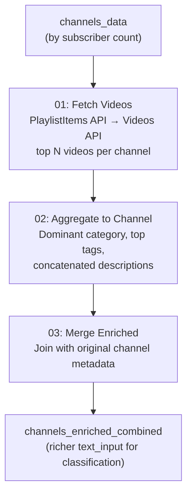

# Video-Level Enrichment

## The Problem with Channel-Level Metadata

Channel metadata is set once by the creator and often left incomplete:

| Field | Typical Population Rate | Issue |
|-------|------------------------|-------|
| `title` | ~99% | Usually populated but may be cryptic ("XxGamer99xX") |
| `description` | ~60-70% | Often empty, boilerplate, or social media links |
| `brandsettings_channel_keywords` | ~30-40% | Many creators never set keywords |
| `topicdetails_categories` | ~50-60% | YouTube's auto-detection is coarse |

When a channel has only a title and nothing else, the [embedding](embeddings.md) is essentially a single phrase — not enough for reliable classification.

## What Video-Level Data Adds

Each video has its own metadata, often richer than the channel's:

| Signal | Source | Why It Helps |
|--------|--------|-------------|
| `video_tags` | Creator-set per video | More specific than channel keywords ("minecraft speedrun 1.20" vs "gaming") |
| `video_description` | Per-video description | Usually more detailed than channel description |
| `category_id` | YouTube's per-video category (1-29) | Direct topic signal |
| `made_for_kids` | Per-video flag | Catches kids channels where channel-level flag is missing |
| `duration` | Video length | Short-form vs. long-form is a useful signal |
| `topic_categories` | YouTube's per-video topics | More granular than channel-level topics |

## How Enrichment Works



### Step 1: Fetch (YouTube API)
- Get the uploads playlist for each channel via PlaylistItems API
- Fetch detailed metadata for top N videos via Videos API
- Checkpoint every 500 channels (resume on failure)

### Step 2: Aggregate
- **Dominant category** — Most common video category across the channel
- **Top tags** — Top 50 tags by frequency across all fetched videos
- **Concatenated descriptions** — Video descriptions joined (capped at 5000 chars)
- **Engagement ratio** — Average likes/views across videos
- **Kids percentage** — % of videos flagged `madeForKids`

### Step 3: Merge
- Join enriched video-level signals with the original channel metadata
- The enriched `text_input` now includes video tags, descriptions, and categories

## Cost Planning

Each channel costs `1 + ceil(videos_per_channel / 50)` API units:

| `videos_per_channel` | Units/Channel | 10K ch | 100K ch | 1.5M ch | Days @ 10K/day |
|:---:|:---:|:---:|:---:|:---:|:---:|
| 1 | 1.02 | 10.2K | 102K | 1.53M | 153 |
| 2 (default) | 1.04 | 10.4K | 104K | 1.56M | 156 |
| 5 | 1.10 | 11K | 110K | 1.65M | 165 |
| 10 | 1.20 | 12K | 120K | 1.80M | 180 |
| 25 | 1.50 | 15K | 150K | 2.25M | 225 |
| 50 | 2.00 | 20K | 200K | 3.00M | 300 |

**Default daily quota:** 10,000 units. Request an increase via Google Cloud Console for production.

## Why Sequential API Calls?

A single YouTube API key has rate limits (~10 req/s). Distributing calls across Spark workers would cause 403 errors. The bottleneck is YouTube quota, not compute. For higher throughput, use multiple API keys with partitioned channel lists.

## Checkpointing

The enrichment pipeline checkpoints every 500 channels to an `enrichment_checkpoint` table. If a run hits the daily quota limit or fails:

1. Re-run the notebook the next day
2. It loads the checkpoint and skips already-processed channels
3. No duplicate API calls, no duplicate rows

## When Enrichment Helps Most

| Scenario | Value |
|----------|-------|
| Channel has empty description + no keywords | **High** — video data is the only text signal |
| Channel has sparse title like "XxGamer99xX" | **High** — video tags reveal the actual topic |
| Channel's madeForKids flag is missing | **Medium** — video-level flags fill the gap |
| Channel already has rich description + keywords | **Low** — additional data is redundant |

## When to Skip Enrichment

- Channel metadata is well-populated (> 70% have description + keywords)
- API quota is limited and classification without enrichment is acceptable
- Quick first pass — run `classify-channels` first, then selectively enrich poorly-classified channels

## DAB Job

```bash
# Enrich then classify in one pipeline
databricks bundle run enrich-and-classify -t dev
```

The `enrich-and-classify` job runs enrichment first (fetch, aggregate, merge), then feeds the enriched data into the classification pipeline. The `data_source_override` parameter tells the classification step to use the enriched table.
