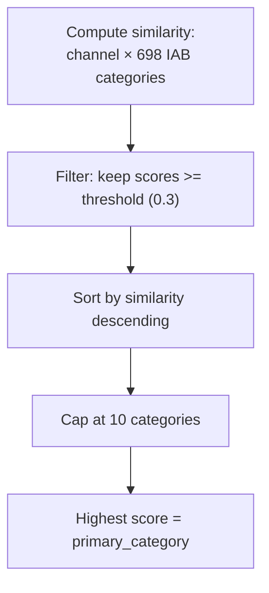

# Multi-Label Classification

## Why Multi-Label?

YouTube channels rarely fit into a single category. A tech review channel might be:
- Technology & Computing
- Technology > Consumer Electronics
- Shopping > Product Reviews
- Entertainment

Forcing a single label loses important information. Multi-label classification assigns **all relevant categories** to each channel.

## How It Works

For each channel, we compute [cosine similarity](cosine-similarity.md) against all ~698 [IAB categories](iab-taxonomy.md). Then we apply rules:

```
Channel "MKBHD" (tech reviewer):
  Technology & Computing            → 0.78  ✓ assigned (primary)
  Technology > Consumer Electronics → 0.72  ✓ assigned
  Technology > Smartphones          → 0.65  ✓ assigned
  Shopping > Product Reviews        → 0.45  ✓ assigned
  Entertainment                     → 0.35  ✓ assigned
  Sports                            → 0.12  ✗ below threshold
  Food & Drink                      → 0.05  ✗ below threshold
```

### Rules

| Rule | Default | Purpose |
|------|---------|---------|
| **Similarity threshold** | 0.3 | Minimum cosine similarity to assign a category |
| **Maximum categories** | 10 | Cap to prevent over-labeling |
| **Primary category** | Highest score | The single best-matching category |

### Assignment Flow



## Threshold Tuning

The `SIMILARITY_THRESHOLD` parameter controls the balance between coverage and precision:

| Threshold | Effect | Use Case |
|-----------|--------|----------|
| 0.2 | Many categories per channel, some noise | Broad discovery, exploratory analysis |
| **0.3 (default)** | **Good balance of coverage and precision** | **General use** |
| 0.4 | Fewer, higher-confidence labels | High-precision targeting |
| 0.5 | Very selective, only strong matches | Brand safety (want to be sure) |

**How to tune:** Monitor the `num_categories` distribution in the output:
- If most channels have 0-1 categories → threshold too high
- If most channels have 8-10 categories → threshold too low
- A healthy distribution peaks at 2-5 categories

### Per-Tier Thresholds

The pipeline supports different thresholds per tier level:

| Parameter | Default | Why |
|-----------|---------|-----|
| `TIER1_THRESHOLD` | 0.3 | Broad categories are easier to match |
| `TIER2_THRESHOLD` | 0.35 | Subcategories need higher confidence to avoid noise |

## Output Format

### Nested Table (`channels_output`)

One row per channel with categories as an array:

| Column | Type | Description |
|--------|------|-------------|
| `primary_category` | string | Highest-scoring category name |
| `primary_tier_path` | string | Full tier path (e.g., "Sports > Basketball") |
| `primary_confidence` | float | Cosine similarity (0.0-1.0) |
| `categories` | array&lt;struct&gt; | All assigned categories |
| `num_categories` | int | Count of assigned categories |

### Flat Table (`channels_classification_flat`)

One row per channel-category pair — best for SQL:

```sql
-- Channels in Sports with high confidence
SELECT channel_id, channel_title, category_name, confidence
FROM channels_classification_flat
WHERE tier_path LIKE 'Sports%' AND confidence >= 0.5

-- Channels in BOTH Gaming AND Music
SELECT a.channel_id, a.channel_title
FROM channels_classification_flat a
JOIN channels_classification_flat b ON a.channel_id = b.channel_id
WHERE a.tier_path LIKE 'Video Gaming%'
  AND b.tier_path LIKE 'Entertainment > Music%'
```

## Why This Approach vs. Alternatives

| Approach | Scales to 1.5M? | Multi-label? | Cost | Quality |
|----------|:---:|:---:|------|---------|
| LLM classifies each channel | No (1.5M calls) | Yes | ~$15K | Highest |
| KMeans clustering | Yes | No (single cluster) | Free | Medium |
| **Cosine similarity (ours)** | **Yes** | **Yes** | **Free** | **Good-High** |
| Train classifier on LLM labels | Yes | Yes | ~$100 | High |

Key advantages:
- **Zero per-channel inference cost** — All compute is matrix multiply on pre-computed [embeddings](embeddings.md)
- **Multi-label native** — Threshold-based, not forced single assignment
- **Deterministic** — Same input always produces same output
- **Interpretable** — Confidence score is cosine similarity, a well-understood metric
